# Casos de Uso Detallados

## CU-01 – Autenticarse en el Sistema

| Campo | Valor |
|---|---|
| **Actores** | Director, Responsable |
| **Precondición** | El `user_id` tiene un `hr_employee` activo vinculado en Odoo. |
| **Postcondición** | JWT almacenado en `localStorage`, cabecera `Authorization: Bearer` inyectada en el cliente Axios. Usuario redirigido a CU-02. |

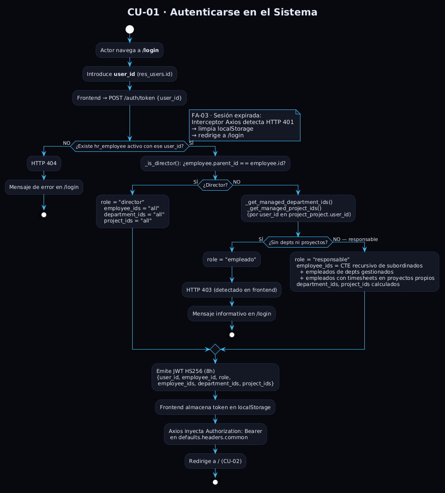

**Flujo principal:**
1. El actor navega a `/login` e introduce su `res_users.id`.
2. `POST /auth/token {user_id}` → el sistema localiza el empleado activo.
3. `resolve_role_and_scope()` determina el rol: si `employee.parent_id == employee.id` → `director`; si gestiona departamentos o proyectos → `responsable`; en otro caso → `empleado` (sin acceso).
4. Para el responsable, se calcula el scope mediante CTE recursivo: `employee_ids`, `department_ids`, `project_ids`.
5. Se emite JWT `HS256` (8 h) con `{user_id, employee_id, role, employee_ids, department_ids, project_ids}`.
6. El frontend almacena el token y redirige a `/`.

**Flujos alternativos:**
- `FA-01`: Sin empleado activo para el `user_id` → HTTP 404, el actor permanece en el login.
- `FA-02`: Rol `"empleado"` → acceso denegado, mensaje informativo.
- `FA-03`: Token expirado en sesión activa → interceptor Axios detecta HTTP 401, limpia `localStorage` y redirige a `/login`.

---

## CU-02 – Visualizar Overview del Sistema

| Campo | Valor |
|---|---|
| **Actores** | Director, Responsable |
| **Precondición** | CU-01 completado. |
| **Postcondición** | El actor dispone de una visión consolidada del estado del sistema y puede navegar a cualquier otro CU. |

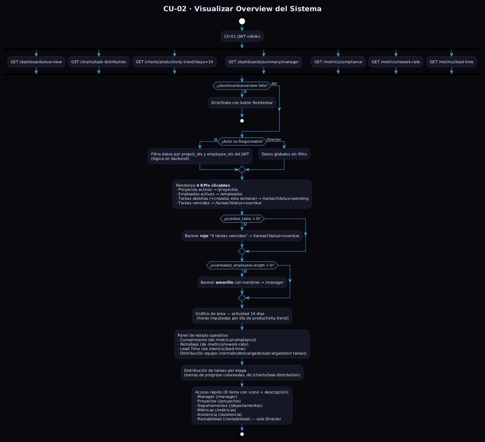

**Flujo principal:**
1. Al navegar a `/`, el sistema lanza en paralelo: `GET /dashboards/overview`, `/charts/task-distribution`, `/charts/productivity-trend?days=14`, `/dashboards/summary/manager`, `/metrics/compliance`, `/metrics/rework-rate`, `/metrics/lead-time`.
2. Se muestran 4 KPIs clicables: proyectos activos, empleados activos, tareas abiertas (+creadas esta semana), tareas vencidas.
3. Si hay tareas vencidas → banner de alerta rojo con enlace a CU-10 (`status=overdue`).
4. Si hay empleados sobrecargados → banner amarillo con sus nombres y enlace a CU-03.
5. Gráfico de área con la actividad de los últimos 14 días y panel de estado operativo (cumplimiento, retrabajo, lead time y distribución del equipo).
6. Distribución de tareas por etapa con barras de progreso y sección de acceso rápido con enlaces a CU-03, CU-08, CU-04, CU-10, CU-22, CU-23.
7. El Responsable recibe los datos filtrados por sus `project_ids` y `employee_ids`.

**Flujos alternativos:**
- `FA-01`: Alguna petición falla → `ErrorState` con botón Reintentar.
- `FA-02`: Sin tareas ni proyectos → KPIs a 0.

**Relaciones:** `<<include>>` CU-13 (cumplimiento), CU-16 (retrabajo), CU-18 (lead time). Navega a CU-03, CU-04, CU-08, CU-10.

---

## CU-03 – Consultar Panel Manager

| Campo | Valor |
|---|---|
| **Actores** | Director, Responsable |
| **Precondición** | CU-01 completado. |
| **Postcondición** | El actor conoce el estado operativo del equipo y puede acceder al detalle de cada empleado. |

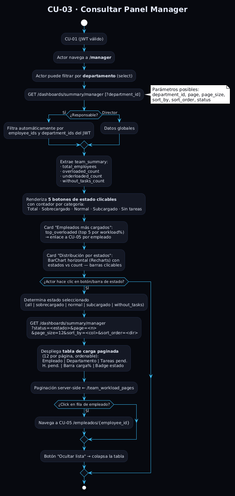

**Flujo principal:**
1. El actor navega a `/manager`. Puede filtrar por departamento mediante un selector.
2. El sistema carga: `GET /dashboards/summary/manager` y `GET /departments/`.
3. Se muestran 5 botones clicables por estado: Total · Sobrecargado · Normal · Subcargado · Sin tareas, con el recuento de cada uno.
4. Card "Empleados más cargados": lista con los 5 empleados con mayor porcentaje de carga y enlace a CU-05.
5. Card "Distribución por estados": gráfico de barras horizontal (Recharts) con los estados vs. su recuento. Las barras son clicables.
6. Al pinchar un botón o barra de estado, el sistema carga la tabla paginada llamando a `GET /dashboards/summary/manager?status=<estado>&page=<n>&page_size=12&sort_by=<col>&sort_order=<dir>`. La tabla muestra: Empleado · Departamento · Tareas pendientes · Horas pendientes · Barra de carga% · Badge estado. Click en fila → CU-05.
7. El Responsable recibe datos filtrados automáticamente por sus `employee_ids` y `department_ids`.

**Flujos alternativos:**
- `FA-01`: Sin empleados en el scope → tabla vacía.

**Relaciones:** `<<include>>` CU-06 (lista de departamentos para filtro). Navega a CU-05.

---

## CU-04 – Listar y Buscar Empleados

| Campo | Valor |
|---|---|
| **Actores** | Director, Responsable |
| **Precondición** | CU-01 completado. |
| **Postcondición** | El actor localiza el empleado buscado y puede navegar a CU-05. |

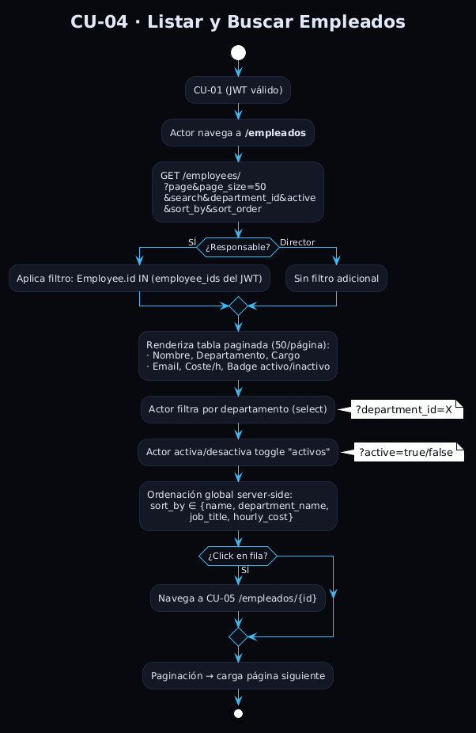

**Flujo principal:**
1. `GET /employees/` con parámetros `page`, `page_size`, `search`, `department_id`, `active`, `sort_by`, `sort_order`.
2. Tabla paginada (50/página): nombre, departamento, cargo, email, coste/h, badge activo/inactivo.
3. Búsqueda por nombre con debounce de 300 ms. Filtro por departamento (select). Toggle para mostrar solo activos.
4. Ordenación global server-side por cualquier columna (nombre, departamento, cargo, coste/h).
5. Click en fila → CU-05.
6. El Responsable solo visualiza empleados incluidos en su `employee_ids`.

**Relaciones:** Navega a CU-05.

---

## CU-05 – Consultar Resumen de Empleado

| Campo | Valor |
|---|---|
| **Actores** | Director, Responsable |
| **Precondición** | CU-01 completado. El empleado está en el alcance del actor. |
| **Postcondición** | El actor conoce el estado completo del empleado: carga, WIP, productividad y tareas. |

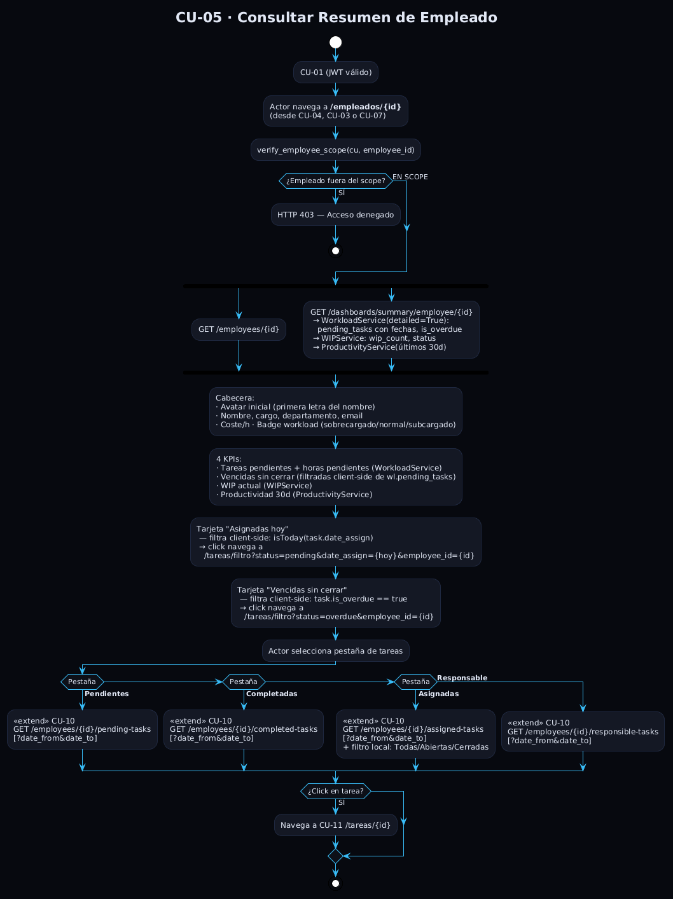

**Flujo principal:**
1. El actor accede a `/empleados/{id}` (desde CU-04, CU-03 o CU-07).
2. El sistema verifica `verify_employee_scope`. Carga en paralelo: `GET /employees/{id}` y `GET /dashboards/summary/employee/{id}` (que internamente ejecuta WorkloadService, WIPService y ProductivityService).
3. Cabecera con avatar de inicial, nombre, cargo, departamento, email, coste/h y badge de estado de carga.
4. 4 KPIs: tareas pendientes + horas pendientes · vencidas sin cerrar · WIP actual · productividad últimos 30d.
5. Sección "Hoy": tarjeta de tareas asignadas hoy (filtradas client-side por `isToday(date_assign)`) y tarjeta de vencidas sin cerrar (filtradas por `is_overdue`). Cada tarjeta es clickable y abre CU-10 con filtros pre-rellenados.
6. Sección de tareas con cuatro pestañas, cada una ejecutando un endpoint diferente:
   - **Pendientes**: `GET /employees/{id}/pending-tasks` con filtro de fecha opcional.
   - **Completadas**: `GET /employees/{id}/completed-tasks` con filtro de fecha opcional.
   - **Asignadas**: `GET /employees/{id}/assigned-tasks` con filtro de fecha y toggle Todas/Abiertas/Cerradas.
   - **Responsable**: `GET /employees/{id}/responsible-tasks` con filtro de fecha opcional.
7. Click en tarea → CU-11.

**Flujos alternativos:**
- `FA-01`: Empleado fuera del scope → HTTP 403.
- `FA-02`: Empleado sin `user_id` vinculado → pestañas de asignadas/pendientes vacías, workload y WIP a 0.

**Relaciones:** `<<extend>>` por CU-10 (listados de tareas contextuales). Navega a CU-11.

---

## CU-06 – Listar Departamentos

| Campo | Valor |
|---|---|
| **Actores** | Director, Responsable |
| **Precondición** | CU-01 completado. |
| **Postcondición** | El actor localiza el departamento y puede navegar a CU-07. |

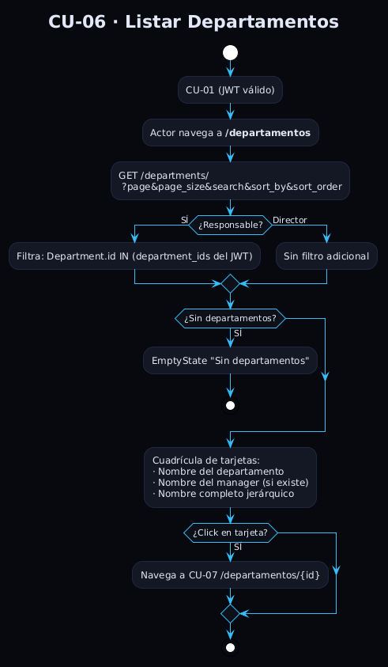

**Flujo principal:**
1. `GET /departments/` → lista de departamentos activos.
2. El Responsable solo visualiza los departamentos incluidos en su `department_ids`.
3. Se muestra una cuadrícula de tarjetas con el nombre del departamento, el nombre del manager (si existe) y el nombre jerárquico completo.
4. Click en tarjeta → CU-07.

**Flujos alternativos:**
- `FA-01`: Sin departamentos en el scope → estado vacío.

**Relaciones:** Navega a CU-07.

---

## CU-07 – Consultar Resumen de Departamento

| Campo | Valor |
|---|---|
| **Actores** | Director, Responsable |
| **Precondición** | CU-01 completado. El departamento está en el alcance del actor. |
| **Postcondición** | El actor conoce el estado de carga del departamento y puede navegar a sus empleados. |

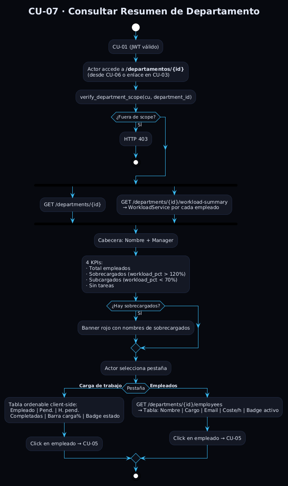

**Flujo principal:**
1. El actor accede a `/departamentos/{id}` (desde CU-06 o enlace en CU-03).
2. El sistema verifica `verify_department_scope`. Carga en paralelo: `GET /departments/{id}` y `GET /departments/{id}/workload-summary`.
3. Cabecera con nombre del departamento y manager.
4. 4 KPIs: total empleados · sobrecargados · subcargados · sin tareas.
5. Si hay empleados sobrecargados → banner rojo con sus nombres.
6. **Pestaña Carga de trabajo**: tabla ordenable con nombre, tareas pendientes, horas pendientes, tareas completadas, barra de % de carga y badge de estado. Click en empleado → CU-05.
7. **Pestaña Empleados**: `GET /departments/{id}/employees` → tabla con cargo, email, coste/h y badge activo. Click en empleado → CU-05.

**Flujos alternativos:**
- `FA-01`: Responsable sin acceso al departamento → HTTP 403.
- `FA-02`: Departamento sin empleados activos → pestañas vacías.

**Relaciones:** Navega a CU-05.

---

## CU-08 – Listar Proyectos

| Campo | Valor |
|---|---|
| **Actores** | Director, Responsable |
| **Precondición** | CU-01 completado. |
| **Postcondición** | El actor localiza el proyecto y puede navegar a CU-09. |

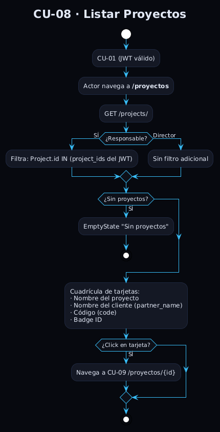

**Flujo principal:**
1. `GET /projects/` → lista de proyectos activos.
2. El Responsable solo visualiza los proyectos incluidos en su `project_ids`.
3. Se muestra una cuadrícula de tarjetas con el nombre del proyecto, el cliente (`partner_name`) y el código.
4. Click en tarjeta → CU-09.

**Flujos alternativos:**
- `FA-01`: Sin proyectos en el scope → estado vacío.

**Relaciones:** Navega a CU-09.

---

## CU-09 – Consultar Resumen de Proyecto

| Campo | Valor |
|---|---|
| **Actores** | Director, Responsable |
| **Precondición** | CU-01 completado. El proyecto está en el alcance del actor. |
| **Postcondición** | El actor conoce el estado completo del proyecto: eficiencia, riesgo, rentabilidad, tareas y equipo. |

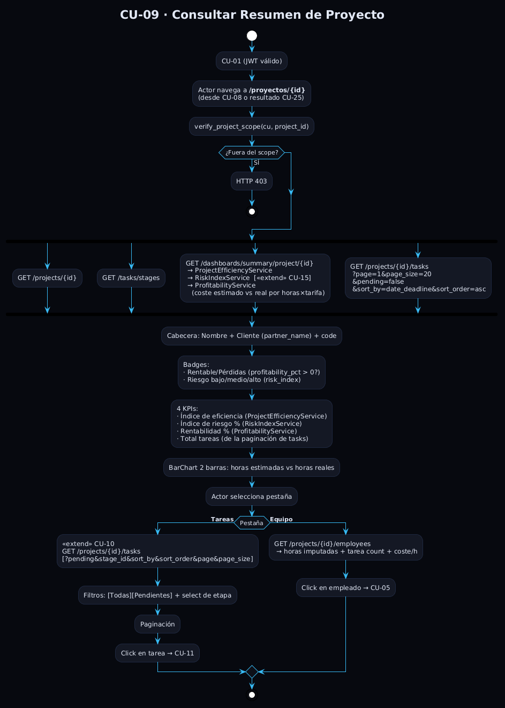

**Flujo principal:**
1. El actor accede a `/proyectos/{id}` (desde CU-08 o resultado de CU-25).
2. El sistema verifica `verify_project_scope`. Carga en paralelo: `GET /projects/{id}`, `/dashboards/summary/project/{id}` y `/tasks/stages`.
3. Cabecera con nombre, cliente y badges de estado: Rentable/Pérdidas (según `profitability_pct`) y nivel de riesgo bajo/medio/alto.
4. 4 KPIs: índice de eficiencia · índice de riesgo % · rentabilidad % · total tareas.
5. Gráfico de barras: horas estimadas vs. reales.
6. **Pestaña Tareas**: `GET /projects/{id}/tasks` con paginación, filtro por estado (Todas/Pendientes) y por etapa. Click en tarea → CU-11.
7. **Pestaña Equipo**: `GET /projects/{id}/employees` → empleados con horas imputadas y coste/h. Click en empleado → CU-05.

**Flujos alternativos:**
- `FA-01`: Sin horas imputadas → rentabilidad y eficiencia a 0.
- `FA-02`: Responsable sin acceso al proyecto → HTTP 403.

**Relaciones:** Navega a CU-05 y CU-11.

---

## CU-10 – Listar Tareas

| Campo | Valor |
|---|---|
| **Actores** | Director, Responsable |
| **Precondición** | CU-01 completado. |
| **Postcondición** | El actor localiza las tareas buscadas o accede al detalle (CU-11). |

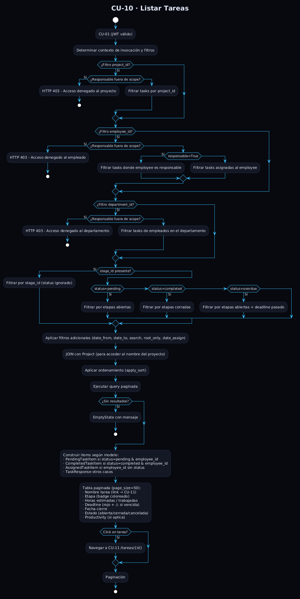

**Flujo principal:**
1. Se ejecuta desde tres contextos:
   - **Global** (`/tareas`): el actor configura filtros manualmente.
   - **Desde CU-09**: `project_id` pre-rellenado.
   - **Desde CU-05**: `employee_id` (y opcionalmente `status`) pre-rellenados.
2. `GET /tasks/filter` con parámetros combinables: `status`, `stage_id`, `project_id`, `employee_id`, `date_from`, `date_to`, `date_assign`, `root_only`, `sort_by`, `sort_order`, `page`, `page_size`. Si `stage_id` está presente, tiene prioridad sobre `status`.
3. Tabla paginada (25/página): nombre, etapa (badge), horas estimadas, deadline (rojo+⚠ si vencida y abierta), fecha cierre, estado (badge).
4. Ordenación global server-side. Click en tarea → CU-11.
5. El Responsable tiene sus tareas restringidas automáticamente a sus `project_ids`.

**Flujos alternativos:**
- `FA-01`: Sin tareas con los filtros aplicados → estado vacío con mensaje.
- `FA-02`: Responsable filtrando por proyecto fuera de su scope → HTTP 403.

**Relaciones:** Navega a CU-11.

---

## CU-11 – Consultar Detalle de Tarea

| Campo | Valor |
|---|---|
| **Actores** | Director, Responsable |
| **Precondición** | CU-01 completado. La tarea pertenece a un proyecto en el alcance del actor. |
| **Postcondición** | El actor conoce todos los datos de la tarea. |

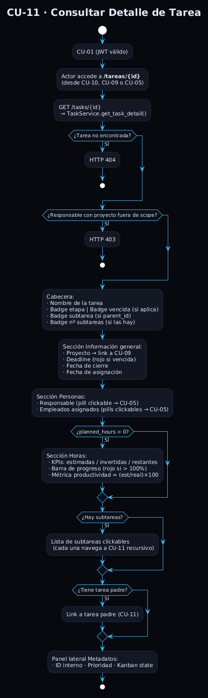

**Flujo principal:**
1. `GET /tasks/{id}` → `TaskService.get_task_detail()` devuelve la ficha completa.
2. Cabecera con nombre, badges de etapa, vencida (si aplica), subtarea (si `parent_id`) y número de subtareas.
3. **Sección Información general**: proyecto (link a CU-09), deadline (rojo si vencida), fecha de cierre, fecha de asignación.
4. **Sección Personas**: responsable como pill clickable (link a CU-05) y empleados asignados como pills clickables (links a CU-05).
5. **Sección Horas** (solo si `planned_hours > 0`): KPIs de horas estimadas, invertidas y restantes; barra de progreso (roja si >100%); métrica de productividad `(estimadas/reales)×100`.
6. **Sección Subtareas** (si las hay): lista de subtareas clickables, cada una abre CU-11 recursivamente.
7. Si `parent_id` existe → enlace a la tarea padre (CU-11). Panel lateral con metadatos: ID, prioridad, kanban state.

**Flujos alternativos:**
- `FA-01`: Tarea no encontrada → HTTP 404.
- `FA-02`: Responsable con tarea fuera de sus proyectos → HTTP 403.

**Relaciones:** Navega a CU-05, CU-09, CU-11 (recursivo en subtareas).

---

## CU-12 – Consultar Productividad

| Campo | Valor |
|---|---|
| **Actores** | Director, Responsable |
| **Precondición** | CU-01. |
| **Postcondición** | El actor conoce la eficiencia de ejecución frente a la estimación. |

**Flujo principal:**
1. El actor navega a `/métricas`. Al cargar la página se pre-cargan datos de soporte para filtros: `GET /employees/?page_size=200` y `GET /projects/`. Las métricas simples (cumplimiento, retrabajo, lead time) se cargan en bulk automáticamente.
2. Al hacer click en la tarjeta "Productividad" se ejecuta `GET /metrics/productivity` con filtros opcionales por empleado, proyecto y rango de fechas.
3. `ProductivityService.calculate()` obtiene tareas cerradas con `planned_hours > 0` y `actual_hours > 0`. Fórmula por tarea: `(planned / actual) × 100`.
4. Gauge con % promedio y total de tareas analizadas; gráfico de barras horizontal con el top 8 de tareas.
5. El Responsable sin filtros recibe el agregado ponderado de todos sus proyectos.

**Relaciones:** Accesible desde `/métricas`.

---

## CU-13 – Consultar Cumplimiento de Plazos

| Campo | Valor |
|---|---|
| **Actores** | Director, Responsable |
| **Precondición** | CU-01. |
| **Postcondición** | El actor conoce la fiabilidad de entrega a tiempo. |

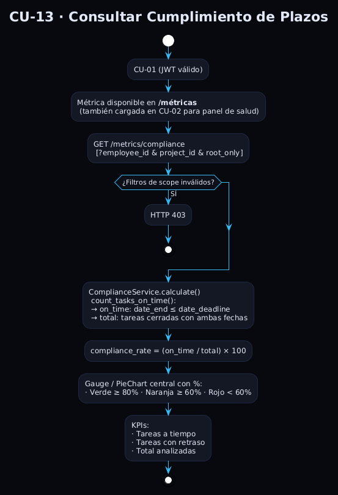

**Flujo principal:**
1. `GET /metrics/compliance` con filtros opcionales `employee_id`, `project_id`, `root_only`.
2. `ComplianceService.calculate()` → `on_time` = tareas con `date_end ≤ date_deadline`; `total` = tareas cerradas con ambas fechas.
3. `compliance_rate = (on_time / total) × 100`.
4. Doughnut chart central con el % y KPIs: tareas a tiempo, con retraso y total.
5. Semáforo: ≥80 % verde · ≥60 % naranja · <60 % rojo.

**Flujos alternativos:**
- `FA-01`: Sin tareas cerradas con fechas → tasa a 0.

**Relaciones:** `<<include>>` desde CU-02 (panel de salud del overview).

---

## CU-14 – Consultar WIP de Empleado

| Campo | Valor |
|---|---|
| **Actores** | Director, Responsable |
| **Precondición** | CU-01. Empleado seleccionado. |
| **Postcondición** | El actor identifica el nivel de paralelismo de tareas abiertas del empleado. |

**Flujo principal:**
1. El actor en `/métricas` selecciona un empleado y hace click en la tarjeta "WIP".
2. `GET /metrics/wip?employee_id=X` → `WIPService.calculate()` cuenta las tareas abiertas asignadas al usuario vinculado al empleado.
3. Umbrales: `wip_count ≤ 3` → óptimo (verde); `≤ 5` → aceptable (naranja); `> 5` → sobrecargado (rojo).
4. Se muestra el recuento, el badge de estado y un mensaje de recomendación textual.

**Flujos alternativos:**
- `FA-01`: Empleado fuera de scope → HTTP 403.
- `FA-02`: Empleado sin `user_id` → WIP = 0, estado óptimo.

**Relaciones:** Accesible desde `/métricas`.

---

## CU-15 – Consultar Riesgo de Proyecto

| Campo | Valor |
|---|---|
| **Actores** | Director, Responsable |
| **Precondición** | CU-01. Proyecto en el alcance del actor. |
| **Postcondición** | El actor identifica las tareas con riesgo de incumplimiento dentro del proyecto. |

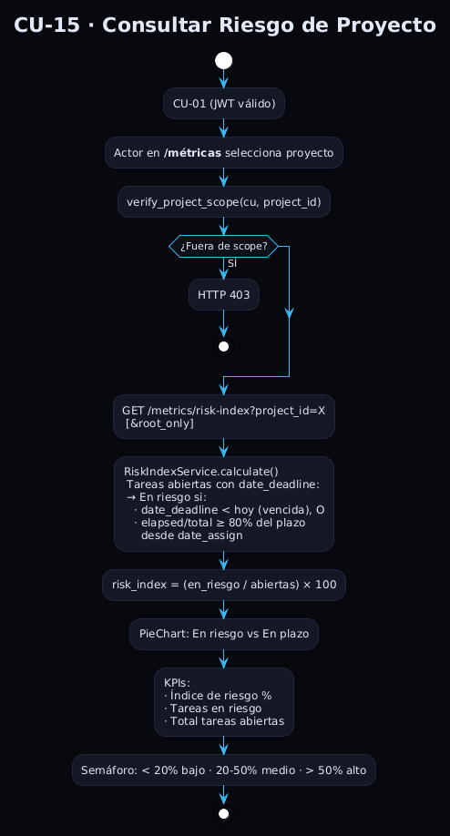

**Flujo principal:**
1. El actor en `/métricas` selecciona un proyecto y hace click en la tarjeta "Índice de riesgo".
2. `GET /metrics/risk-index?project_id=X` → `RiskIndexService.calculate()` analiza las tareas abiertas con `date_deadline`.
3. Una tarea está en riesgo si: `date_deadline < hoy` (vencida), O ha consumido ≥80 % del tiempo desde `date_assign` hasta `date_deadline`.
4. `risk_index = (en_riesgo / abiertas) × 100`.
5. Doughnut chart (en riesgo vs. en plazo), KPIs y semáforo: <20 % bajo · 20-50 % medio · >50 % alto.

**Flujos alternativos:**
- `FA-01`: Proyecto fuera de scope → HTTP 403.
- `FA-02`: Sin tareas abiertas con deadline → riesgo 0.

**Relaciones:** Accesible desde `/métricas`. También ejecutado por CU-09 vía `GET /dashboards/summary/project/{id}`.

---

## CU-16 – Consultar Tasa de Retrabajo

| Campo | Valor |
|---|---|
| **Actores** | Director, Responsable |
| **Precondición** | CU-01. |
| **Postcondición** | El actor detecta problemas de calidad o proceso mediante el análisis de tareas reabiertas. |

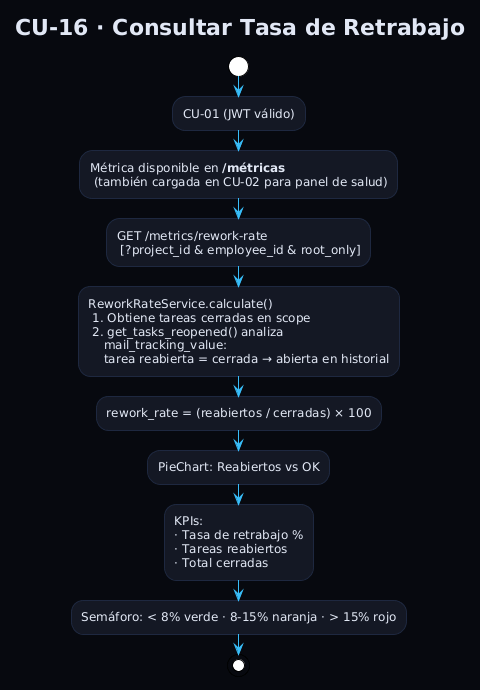

**Flujo principal:**
1. `GET /metrics/rework-rate` con filtros opcionales `project_id`, `employee_id`, `root_only`.
2. `ReworkRateService` → obtiene tareas cerradas en el scope, luego `get_tasks_reopened()` analiza el historial de `mail_tracking_value`: una tarea reabierta es aquella que transita de etapa cerrada a etapa abierta.
3. `rework_rate = (reabiertos / cerradas_total) × 100`.
4. Doughnut chart (reabiertos vs. OK), KPIs y semáforo: <8 % verde · 8-15 % naranja · >15 % rojo.

**Flujos alternativos:**
- `FA-01`: Sin tareas cerradas → tasa 0.

**Relaciones:** `<<include>>` desde CU-02 (panel de salud del overview).

---

## CU-17 – Consultar Exactitud de Estimación

| Campo | Valor |
|---|---|
| **Actores** | Director, Responsable |
| **Precondición** | CU-01. Empleado (responsable de tarea) seleccionado. |
| **Postcondición** | El actor calibra la fiabilidad de las estimaciones del responsable seleccionado. |

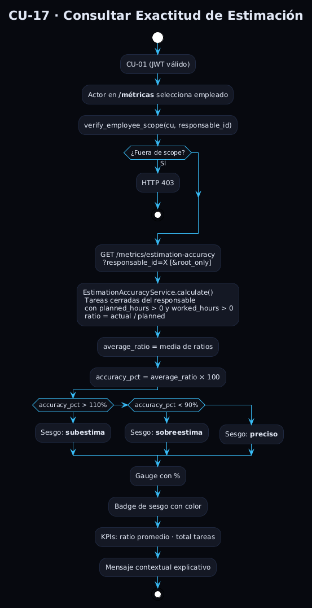

**Flujo principal:**
1. El actor en `/métricas` selecciona un empleado.
2. `GET /metrics/estimation-accuracy?responsable_id=X` → `EstimationAccuracyService` analiza tareas cerradas del responsable con `planned_hours > 0` y `worked_hours > 0`. Ratio por tarea: `actual / planned`.
3. `average_ratio` = media de todos los ratios; `accuracy_pct = average_ratio × 100`.
4. Sesgo: `subestima` (>110 %) · `sobreestima` (<90 %) · `preciso` (90–110 %).
5. Gauge con %, badge de sesgo con color, ratio promedio, total tareas y mensaje contextual explicativo.

**Flujos alternativos:**
- `FA-01`: Empleado fuera de scope → HTTP 403.
- `FA-02`: Sin tareas con datos suficientes → sesgo `sin_datos`, valor a 0.

**Relaciones:** Accesible desde `/métricas`.

---

## CU-18 – Consultar Lead Time

| Campo | Valor |
|---|---|
| **Actores** | Director, Responsable |
| **Precondición** | CU-01. |
| **Postcondición** | El actor identifica el tiempo medio de ciclo de las tareas. |

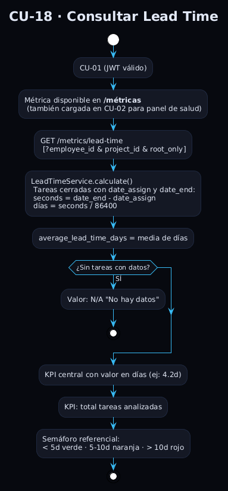

**Flujo principal:**
1. `GET /metrics/lead-time` con filtros opcionales `employee_id`, `project_id`, `root_only`.
2. `LeadTimeService.calculate()` → tareas cerradas con `date_assign` y `date_end`. Días = `(date_end - date_assign).seconds / 86400`.
3. `average_lead_time_days` = media de todos los valores.
4. KPI central con el valor en días (ej.: 4.2d) y total de tareas analizadas.
5. Semáforo referencial: <5d verde · 5-10d naranja · >10d rojo.

**Flujos alternativos:**
- `FA-01`: Sin tareas con ambas fechas → valor N/A.

**Relaciones:** `<<include>>` desde CU-02 (panel de salud del overview).

---

## CU-19 – Consultar Tiempo por Estado

| Campo | Valor |
|---|---|
| **Actores** | Director, Responsable |
| **Precondición** | CU-01. |
| **Postcondición** | El actor identifica etapas con tiempos excesivos de permanencia. |

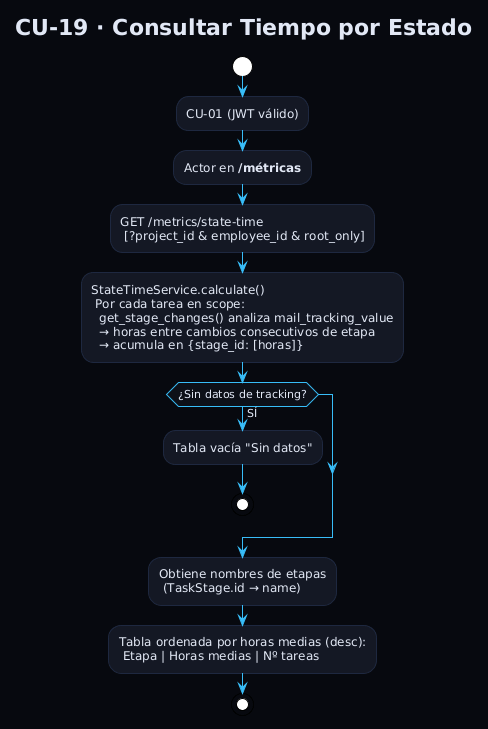

**Flujo principal:**
1. `GET /metrics/state-time` con filtros opcionales `project_id`, `employee_id`, `root_only`.
2. `StateTimeService.calculate()` → por cada tarea en el scope, `get_stage_changes()` obtiene los cambios de etapa desde `mail_tracking_value` y calcula las horas de permanencia entre cambios consecutivos.
3. Se agrega por etapa: `{stage_id: [horas]}` y se calcula la media.
4. Los nombres de etapa se obtienen desde `TaskStage`.
5. Tabla ordenada de mayor a menor por horas medias: Etapa · Horas medias · Nº tareas.

**Flujos alternativos:**
- `FA-01`: Sin datos de tracking en `mail_tracking_value` → tabla vacía.

**Relaciones:** Accesible desde `/métricas`.

---

## CU-20 – Consultar Tareas Canceladas

| Campo | Valor |
|---|---|
| **Actores** | Director, Responsable |
| **Precondición** | CU-01. |
| **Postcondición** | El actor evalúa la tasa de cancelación del proceso. |

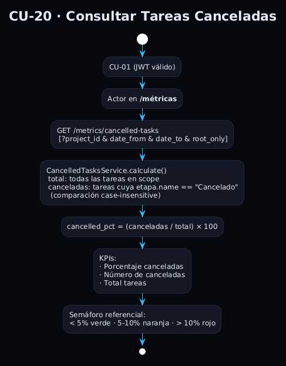

**Flujo principal:**
1. `GET /metrics/cancelled-tasks` con filtros opcionales `project_id`, `date_from`, `date_to`, `root_only`.
2. `CancelledTasksService.calculate()` → `total` = todas las tareas en el scope; `canceladas` = tareas cuya etapa tiene el nombre "Cancelado" (comparación case-insensitive sobre el nombre traducido).
3. `cancelled_pct = (canceladas / total) × 100`.
4. KPIs: porcentaje de canceladas · número de canceladas · total de tareas.
5. Semáforo referencial: <5 % verde · 5-10 % naranja · >10 % rojo.

**Flujos alternativos:**
- `FA-01`: Sin tareas → porcentaje a 0.

**Relaciones:** Accesible desde `/métricas`.

---

## CU-21 – Consultar Tiempo por Prioridad

| Campo | Valor |
|---|---|
| **Actores** | Director, Responsable |
| **Precondición** | CU-01. |
| **Postcondición** | El actor verifica cómo se distribuye el esfuerzo según la prioridad de las tareas. |

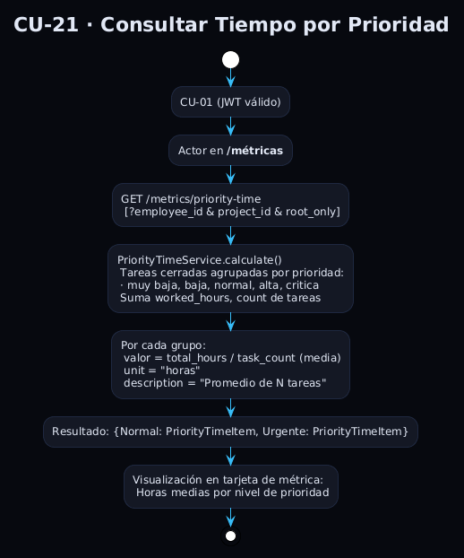

**Flujo principal:**
1. `GET /metrics/priority-time` con filtros opcionales `employee_id`, `project_id`, `root_only`.
2. `PriorityTimeService.calculate()` → tareas cerradas agrupadas por campo `priority` ("0" = Normal, "1" = Urgente). Suma `worked_hours` y cuenta tareas por grupo.
3. Resultado: media de horas por prioridad (`total_hours / task_count`).
4. Se muestra como `PriorityTimeItem` con valor, unidad ("horas") y descripción (ej.: "Promedio de 12 tareas").

**Flujos alternativos:**
- `FA-01`: Sin tareas clasificadas → resultado vacío.

**Relaciones:** Accesible desde `/métricas`.

---

## CU-22 – Visualizar Gráficos Analíticos

| Campo | Valor |
|---|---|
| **Actores** | Director, Responsable |
| **Precondición** | CU-01. |
| **Postcondición** | El actor analiza tendencias y distribuciones visualmente. |

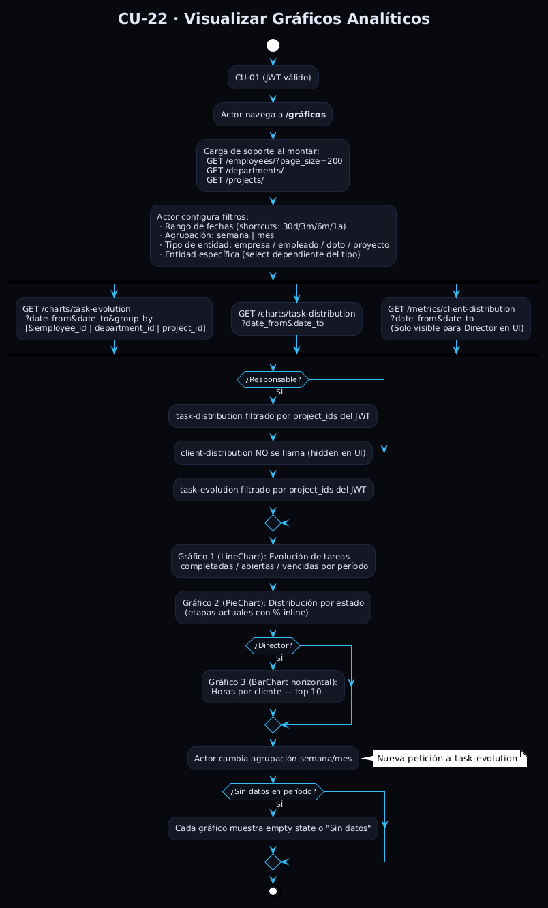

**Flujo principal:**
1. El actor navega a `/gráficos`. Al cargar se obtienen los datos de soporte: `GET /employees/`, `GET /departments/`, `GET /projects/`.
2. El actor configura el rango de fechas (con atajos 30d/3m/6m/1a), la agrupación (semana/mes) y el tipo de filtro (empresa/empleado/departamento/proyecto).
3. Se cargan tres gráficos en paralelo: `GET /charts/task-evolution`, `GET /charts/task-distribution`, `GET /metrics/client-distribution` (solo Director).
4. **Gráfico 1** (LineChart): evolución de tareas completadas / abiertas / vencidas por período.
5. **Gráfico 2** (PieChart): distribución de tareas por etapa con % inline.
6. **Gráfico 3** (BarChart horizontal): horas registradas por cliente — solo visible para el Director.
7. Al cambiar agrupación o filtros, se recalcula la evolución con una nueva petición.

**Flujos alternativos:**
- `FA-01`: Sin datos en el período → cada gráfico muestra "Sin datos".
- `FA-02`: El Responsable no ve `client-distribution`; los datos de evolución se filtran por sus `project_ids`.

**Relaciones:** `<<include>>` CU-04 (empleados), CU-06 (departamentos), CU-08 (proyectos) para los selectores de filtro.

---

## CU-23 – Consultar Asistencia vs Imputaciones

| Campo | Valor |
|---|---|
| **Actores** | Director, Responsable |
| **Precondición** | CU-01. |
| **Postcondición** | El actor detecta discrepancias entre la presencia física (fichajes) y las horas imputadas en partes analíticos. |

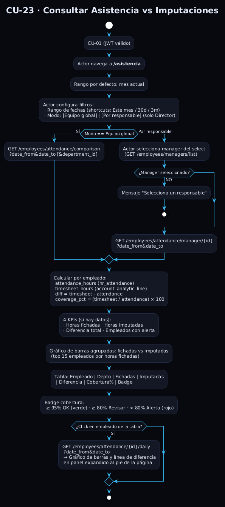

**Flujo principal:**
1. El actor navega a `/asistencia`. El rango por defecto es el mes actual.
2. Al cargar se obtienen: `GET /employees/managers/list` y `GET /departments/`.
3. El actor selecciona el modo de vista: **Equipo global** o **Por responsable** (solo Director). Configura el rango de fechas y opcionalmente filtra por departamento.
4. En modo "Equipo global": `GET /employees/attendance/comparison?date_from&date_to [&department_id]`.  En modo "Por responsable": `GET /employees/attendance/manager/{id}?date_from&date_to`.
5. Se calculan por empleado: `attendance_hours` (de `hr_attendance`), `timesheet_hours` (de `account_analytic_line`), `diff` y `coverage_pct = (timesheet / attendance) × 100`.
6. 4 KPIs de resumen · gráfico de barras (fichadas vs. imputadas, top 15) · tabla de empleados con badge de cobertura (OK ≥95 % · Revisar ≥80 % · Alerta <80 %).
7. Click en empleado → `GET /employees/attendance/{id}/daily` → panel expandido con gráfico de serie diaria y línea de diferencia al pie de la página.

**Flujos alternativos:**
- `FA-01`: Sin datos en el período → KPIs a 0 y tabla vacía.
- `FA-02`: Responsable → no dispone del modo "Por responsable".

**Relaciones:** `<<include>>` CU-04 (empleados), CU-06 (departamentos) para los selectores de filtro.

---

## CU-24 – Consultar Rentabilidad Financiera

| Campo | Valor |
|---|---|
| **Actores** | **Director** (exclusivo) |
| **Precondición** | CU-01 con `role = "director"`. |
| **Postcondición** | El Director conoce la rentabilidad real por proyecto, cliente y responsable. |

**Flujo principal:**
1. El actor navega a `/rentabilidad`. Selecciona rango de fechas y modo de filtro: Global · Por proyecto · Por responsable.
2. Los datos provienen de `account_analytic_line.amount` (positivo = ingreso, negativo = gasto).
3. `GET /metrics/profitability/summary` → 4 KPIs: ingresos · gastos · neto · rentabilidad %.
4. Gráfico de barras agrupadas (ingresos vs. gastos por proyecto, top 12) y donut de estados (Ganancia/Neutro/Pérdida).
5. **Pestaña Por proyecto**: `GET /metrics/profitability/per-project` con columnas income, expense, net, horas, rentabilidad%, badge y botón "Ver Detalles" (extiende a CU-26).
6. **Pestaña Por cliente**: `GET /metrics/profitability/per-client` agrupando por `partner_id`, con botón "Ver Detalles" (extiende a CU-27).
7. En modo "Por responsable": un selector permite elegir manager; botón "Ver detalle →" carga un panel individual con `GET /metrics/profitability/manager/{id}`, su tabla de proyectos y un gráfico de barras.

**Flujos alternativos:**
- `FA-01`: Sin partes analíticos en el período → todo a 0.
- `FA-02`: Responsable intentando acceder → HTTP 403, pantalla "Acceso restringido".

**Relaciones:** `<<extend>>` por CU-26 (líneas por proyecto) y CU-27 (líneas por cliente).

---

## CU-25 – Realizar Búsqueda Global

| Campo | Valor |
|---|---|
| **Actores** | Director, Responsable |
| **Precondición** | CU-01. Mínimo 2 caracteres de entrada. |
| **Postcondición** | El actor localiza el recurso buscado y navega a su detalle. |

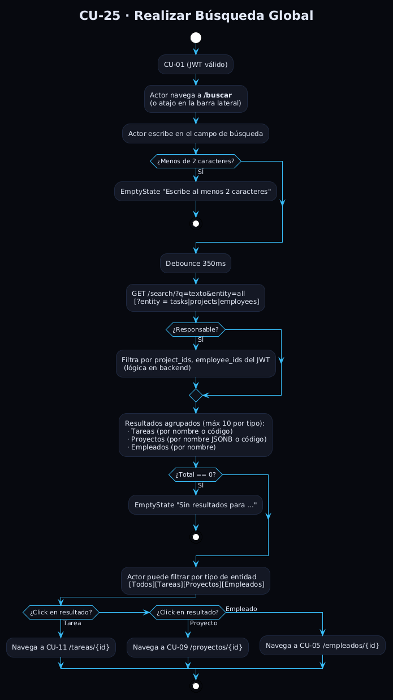

**Flujo principal:**
1. El actor navega a `/buscar` (o usa el acceso directo de la barra lateral).
2. Al escribir ≥ 2 caracteres se activa el debounce de 350 ms.
3. `GET /search/?q=texto&entity=all` → resultados agrupados: tareas (por nombre/código), proyectos (por nombre JSONB/código) y empleados (por nombre); máximo 10 por tipo.
4. El Responsable recibe los resultados filtrados por su scope (backend).
5. El actor puede refinar por tipo de entidad con los botones [Todos][Tareas][Proyectos][Empleados].
6. Click en resultado tarea → CU-11; proyecto → CU-09; empleado → CU-05.

**Flujos alternativos:**
- `FA-01`: Sin resultados → estado vacío con mensaje.

**Relaciones:** Navega a CU-05, CU-09, CU-11.

---

## CU-26 – Consultar Líneas Analíticas de Proyecto

| Campo | Valor |
|---|---|
| **Actores** | **Director** (exclusivo) |
| **Precondición** | CU-01 con `role = "director"`. Proyecto seleccionado en CU-24. |
| **Postcondición** | El Director conoce el desglose de ingresos y gastos individuales del proyecto. |

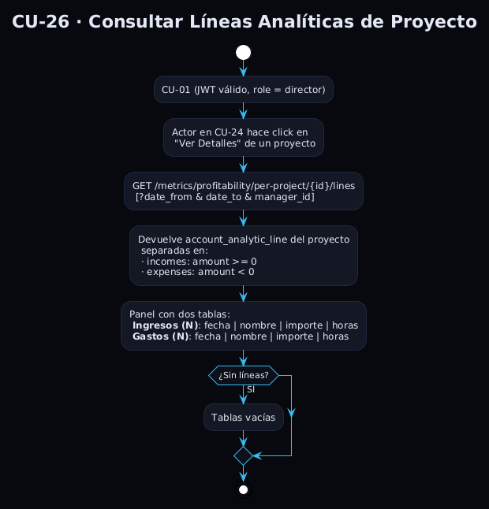

**Flujo principal:**
1. Desde CU-24, el actor hace click en "Ver Detalles" en una fila de proyecto.
2. `GET /metrics/profitability/per-project/{project_id}/lines` con filtros opcionales de fecha y manager.
3. Las líneas de `account_analytic_line` se separan en `incomes` (amount ≥ 0) y `expenses` (amount < 0).
4. Se muestran dos tablas dentro de la misma vista: **Ingresos** y **Gastos**, con columnas fecha · nombre · importe · horas.

**Flujos alternativos:**
- `FA-01`: Sin líneas en el período → tablas vacías.

**Relaciones:** `<<extend>>` desde CU-24.

---

## CU-27 – Consultar Líneas Analíticas de Cliente

| Campo | Valor |
|---|---|
| **Actores** | **Director** (exclusivo) |
| **Precondición** | CU-01 con `role = "director"`. Cliente seleccionado en CU-24. |
| **Postcondición** | El Director conoce el desglose de ingresos y gastos individuales del cliente (agregados de sus proyectos). |

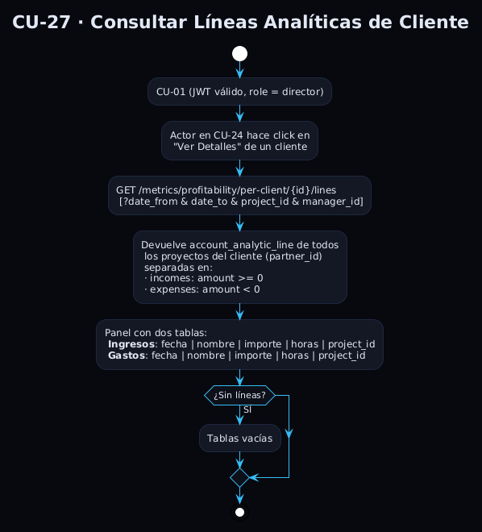

**Flujo principal:**
1. Desde CU-24, el actor hace click en "Ver Detalles" en una fila de cliente.
2. `GET /metrics/profitability/per-client/{client_id}/lines` con filtros opcionales de fecha, proyecto y manager.
3. Se obtienen las líneas de `account_analytic_line` de todos los proyectos del cliente (filtrado por `Project.partner_id`), separadas en `incomes` y `expenses`.
4. Dos tablas con columnas fecha · nombre · importe · horas · project_id.

**Flujos alternativos:**
- `FA-01`: Cliente sin proyectos con líneas → tablas vacías.

**Relaciones:** `<<extend>>` desde CU-24.

---

## CU-28 – Consultar Carga de Trabajo (Workload) de Empleado

| Campo | Valor |
|---|---|
| **Actores** | Director, Responsable |
| **Precondición** | CU-01. Empleado seleccionado. |
| **Postcondición** | El actor identifica si el empleado está sobre o infracargado de trabajo. |

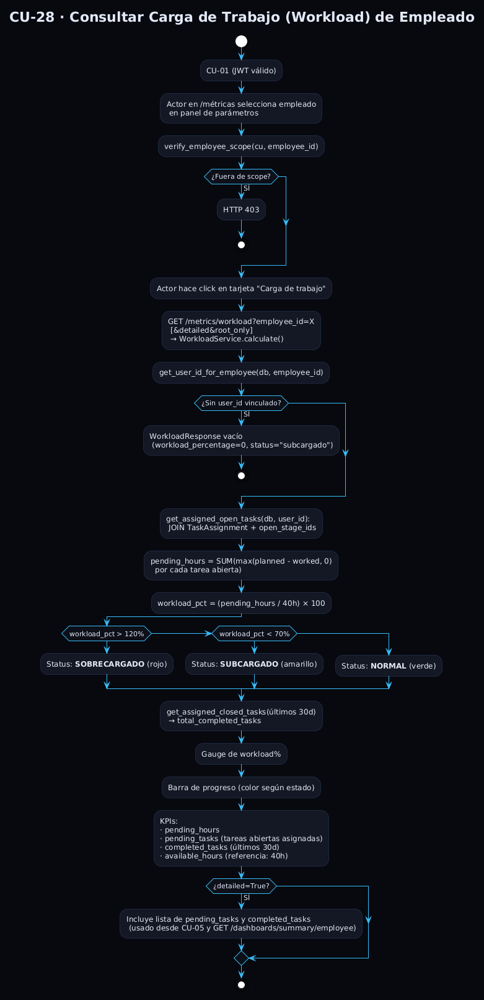

**Flujo principal:**
1. El actor en `/métricas` selecciona un empleado y hace click en "Carga de trabajo".
2. `GET /metrics/workload?employee_id=X [&detailed&root_only]` → `WorkloadService.calculate()`.
3. Se obtienen las tareas abiertas asignadas al usuario y se suma `max(planned - worked, 0)` por tarea → `pending_hours`.
4. `workload_pct = (pending_hours / 40h) × 100`. Estado: `sobrecargado` (>120 %) · `normal` (70-120 %) · `subcargado` (<70 %).
5. Gauge con %, barra de progreso coloreada según estado y KPIs: horas pendientes · tareas pendientes · tareas completadas (últimos 30d).

**Flujos alternativos:**
- `FA-01`: Empleado fuera de scope → HTTP 403.
- `FA-02`: Sin `user_id` vinculado → `pending_hours = 0`, estado `subcargado`.

**Relaciones:** Accesible desde `/métricas`. Su resultado también se usa internamente en `GET /dashboards/summary/employee/{id}` (CU-05) y `GET /dashboards/summary/manager` (CU-03).
