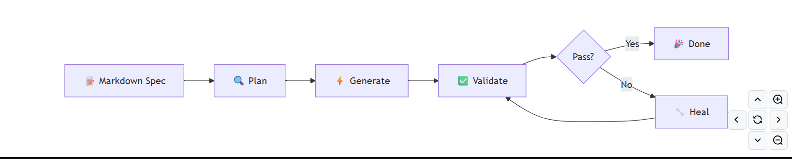

# Estado del Arte

## Contexto empresarial de CIC Consulting Informático
CIC Consulting Informático es una empresa de ingeniería y desarrollo de proyectos de informática y comunicaciones.
En el proceso actual de QA en CIC, el trabajo comienza con una reunión por parte del cliente con el Project Manager, en esa reunión se recogen los requisitos del producto y los casos de uso que debería tener; esto se plasma sobre documentación, en este caso utilizan DRF (Documentos Requisitos Funcionales) y DDS (Documento Diseño Sistema). 

A partir de esta información, el ingeniero de QA define planes de prueba que actualmente están en un Excel y algunos de ellos se referencian en una carpeta dentro de VSCode con estructuras Gherkin propio de Kiwi TCMS pero no se usa ninguna API, ejecuta las pruebas end-to-end en Cypress y documenta incidencias o resultados en las herramientas correspondientes.

Este flujo de trabajo se apoya en herramientas ya existentes detalladas en la foto que se presenta a continuación y en la experiencia del personal de QA, pero mantiene una importante dependencia del análisis manual y de la intervención directa del ingeniero. 

 
Por lo que para el ingeniero de QA supone un gran esfuerzo interpretar correctamente la documentación de entrada y traducirla a elementos útiles para validar el producto.

**En consecuencia**, el trabajo se centra en estudiar cómo una arquitectura basada en agentes de Inteligencia Artificial puede analizar documentos DRF y DDS, extraer información funcional relevante (requisitos funcionales y casos de uso), transformarlo a escenarios Gherkin y registrar los scenarios (given, and, when, then) en planes de prueba en Kiwi TCMS a través de su API. 
Soluciones existentes relacionadas: Quorvex AI

## Solución Existente Aproximada

En el panorama actual del testing asistido por Inteligencia Artificial, han comenzado a aparecer soluciones que no se limitan a ejecutar pruebas automatizadas, sino que también intervienen en su construcción a partir de descripciones funcionales en lenguaje natural. Dentro de este contexto, una de las propuestas más próximas al enfoque de este trabajo es Quorvex AI, una herramienta orientada a la generación automática de tests a partir de especificaciones redactadas en lenguaje natural.

El interés de esta solución reside en que plantea un modelo de trabajo en el que la IA no actúa solo como generador de texto, sino como un componente capaz de participar en varias fases del proceso de testing. A partir de una especificación inicial, el sistema analiza la información proporcionada, genera un plan de ejecución, construye el test correspondiente y posteriormente lo valida sobre la aplicación real. En caso de detectar errores durante la ejecución, la propia herramienta puede corregir automáticamente parte del código generado con autorreparación.

Quorvex AI se apoya principalmente en Playwright como framework de automatización y en modelos de lenguaje para interpretar la especificación y la transforma en código ejecutable. Esto le permite convertir descripciones escritas en lenguaje natural en pruebas end-to-end para que las ejecute, esto reduce parte del esfuerzo manual que normalmente requiere la construcción inicial de los tests.

No obstante, esta solución presenta limitaciones. En primer lugar, el enfoque está claramente orientado a la generación de tests ejecutables directamente en Playwright, lo que implica una dependencia fuerte de este framework. Además, aunque automatiza la construcción y repara pruebas, no está tan centrada en la gestión documental previa ni en la integración con herramientas de gestión de pruebas como Kiwi TCMS, que sí constituyen una parte importante de la propuesta desarrollada en este trabajo.

Por tanto, Quorvex AI puede considerarse una solución existente y relevante, especialmente por su capacidad para transformar especificaciones naturales en artefactos de testing automatizado. Pero su objetivo se sitúa en una fase distinta del proceso. Mientras Quorvex AI se orienta a la generación directa de tests end-to-end ejecutables, la propuesta de este TFG se centra en una etapa previa, aunque de cierta manera y en líneas futuras se asemeja.
