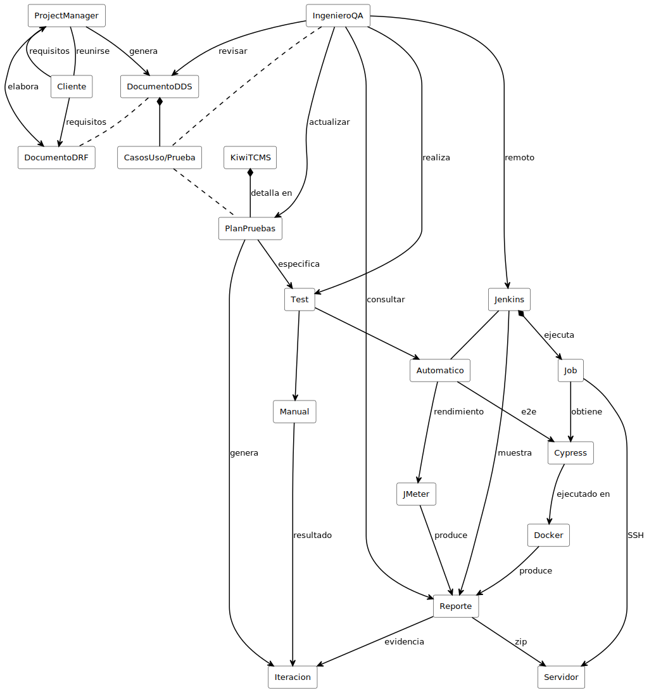

# Introducción

El presente Trabajo de Fin de Grado consiste en la aplicación de agentes de Inteligencia Artifical dentro de la parte de testing de QA en la empresa CIC Consulting Informático. 

El trabajo surge a partir de una necesidad en el contexto de QA de CIC, donde una parte del esfuerzo de los ingenieros de QA se concetra en interpretar documentación funcional y técnica, en crear planes de prueba y eso requiere mucho tiempo y experiencia.

El TFG por tanto plantea el diseño de una solución que esta orientada a automatizar una parte concreta del flujo de trabajo de QA, esta solución se apoya en un sistema multiagente desarrollado con Google ADK.

## Contexto general de la calidad del software
La calidad de software es esencial a la hora de desarrollar, ya que tiene una relación directa con el producto del cliente, la experiencia del usuario, con el mantenimiento y con la confianza de los clientes. Desarrollar software de mala calidad puede generar incidencias, retrasos, costes y problemas que afectan a la empresa y a los desarrolladores.

La calidad del software no se limita a que una app funcione, sino que se haga de manera correcta y alineada con los requisitos y casos de uso definidos previamente. 
Entonces, el asegurar la calidad o QA (Quality Assurance), representa el conjunto de procesos, prácticas y mecanismos que garantizan que el software se desarrolla y se valida en base a unos estándares definidos. Este previene defectos, da fiabilidad y evidencia que el sistema cumple con la calidad esperada, es decir, es una capa de control y de mejora continua.

## Papel del testing
El testing constituye una de las actividades más relevantes dentro de QA. La función principal del mismo es diseñar, ejecutar y evaluar pruebas con el fin de comprobar si un sistema se comporta según lo esperado. A través del testing se validan requisitos, se detectan defectos antes de la puesta en producción y da la confianza sobre el estado del producto.

Podemos decir que el testing tradicional tiene ciertas limitaciones, muchas veces el proceso depende de un esfuerzo manual considerable para interpretar documentación, diseñar casos de prueba, ejecutar validaciones y registrar incidencias, lo que incrementa el tiempo necesario y la carga operativa del equipo. La repetición de tareas similares y depender del conocimiento del ingeniero de QA dificultan la escalabilidad del proceso y pueden limitar tanto la cobertura como la capacidad de adaptación ante nuevas necesidades del proyecto.

## Contexto empresarial de CIC Consulting Informático
CIC Consulting Informático es una empresa de ingeniería y desarrollo de proyectos de informática y comunicaciones.
En el proceso actual de QA en CIC, el trabajo comienza con una reunión por parte del cliente con el Project Manager, en esa reunión se recogen los requisitos del producto y los casos de uso que debería tener; esto se plasma sobre documentación, en este caso utilizan DRF (Documentos Requisitos Funcionales) y DDS (Documento Diseño Sistema). 

A partir de esta información, el ingeniero de QA define planes de prueba que actualmente están en un Excel y algunos de ellos en una carpeta dentro de VSCode con estructuras Gherkin, ejecuta las pruebas end-to-end y documenta incidencias o resultados en las herramientas correspondientes.

Este flujo de trabajo se apoya en herramientas ya existentes detalladas en la foto que se presenta a continuación y en la experiencia del personal de QA, pero mantiene una importante dependencia del análisis manual y de la intervención directa del ingeniero. 

 
Por lo que para el ingeniero de QA supone un gran esfuerzo interpretar correctamente la documentación de entrada y traducirla a elementos útiles para validar el producto.

**En consecuencia**, el trabajo se centra en estudiar cómo una arquitectura basada en agentes de Inteligencia Artificial puede analizar documentos DRF y DDS, extraer información funcional relevante (requisitos funcionales y casos de uso), transformarlo a escenarios Gherkin y registrar los scenarios (given, and, when, then) en planes de prueba en Kiwi TCMS a través de su API. 
