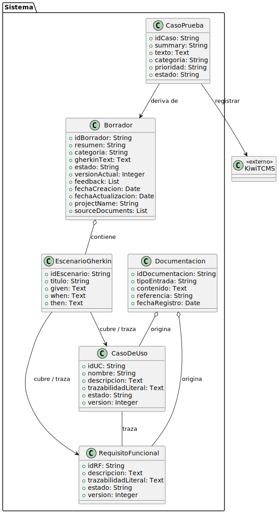
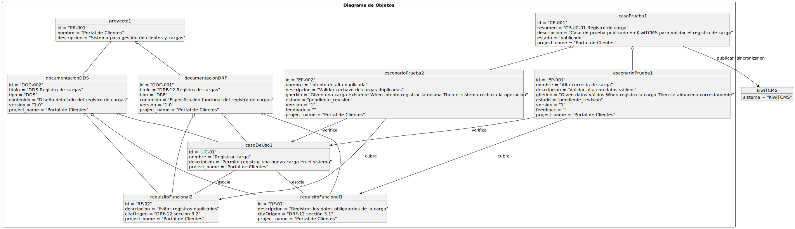
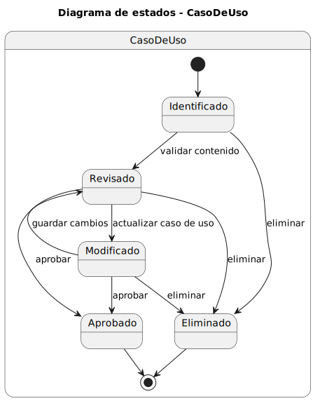
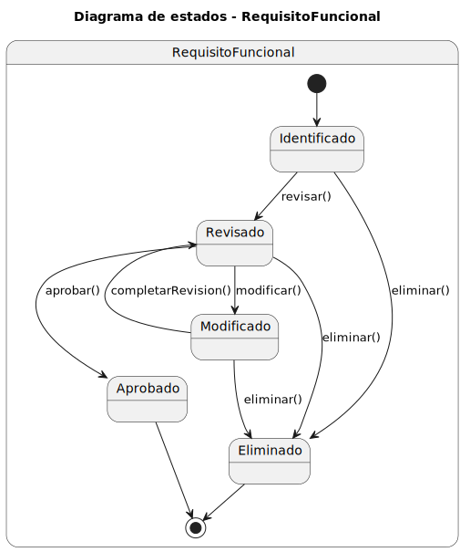
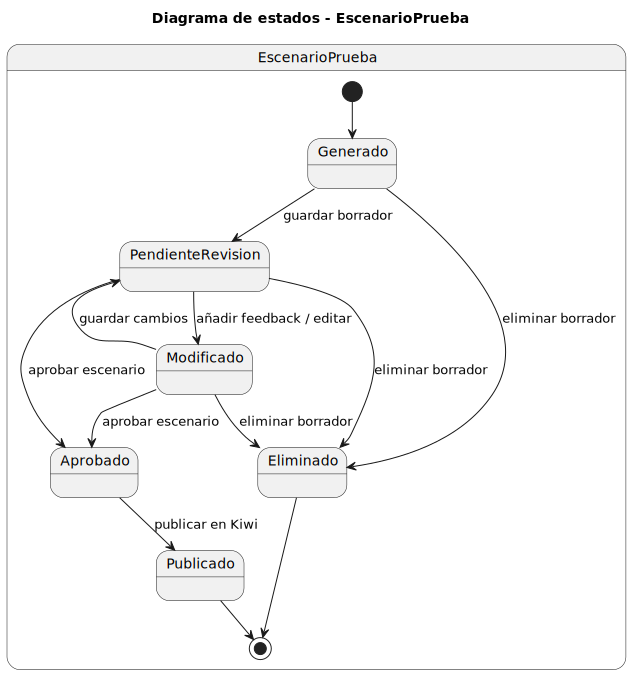

## Modelo de Dominio

  

#### Explicacion

En el contexto organizativo, los proyectos agrupan la documentación, que constituye la entrada principal del sistema. Dicha documentación contiene la información necesaria para la obtención de los casos de uso y los requisitos funcionales, que describen el comportamiento esperado del sistema. Asimismo, el modelo establece una asociación entre casos de uso y requisitos funcionales con el objetivo de garantizar la trazabilidad funcional.

A partir de estos elementos se generan escenarios de prueba, los cuales permiten verificar el comportamiento definido en los casos de uso y asegurar la cobertura de los requisitos funcionales. Estos escenarios evolucionan hasta convertirse en casos de prueba, que representan el artefacto final gestionado por el sistema.

Finalmente, los casos de prueba son publicados o sincronizados con el sistema externo participante, Kiwi TCMS, encargado de su almacenamiento, gestión y consulta.

De este modo, el modelo define una relación coherente entre todos los elementos del sistema, manteniendo la trazabilidad completa desde la documentación inicial hasta la validación final, independientemente de que el proceso se realice de forma manual o automatizada.

## Diagrama de Clases

  

## Diagrama de Objetos

  

## Diagramas de Estado

### Estados de `CasoDeUso`

  

#### Explicacion

El `CasoDeUso` nace en `Identificado`, pasa a `Revisado` cuando su contenido ha sido validado, puede entrar en `Modificado` si se actualiza y finalmente alcanza `Aprobado` cuando queda aceptado. Desde los estados intermedios tambien puede pasar a `Eliminado` si deja de ser necesario.

### Estados de `RequisitoFuncional`

  

#### Explicacion

El `RequisitoFuncional` sigue una evolucion paralela a la del caso de uso. Parte de `Identificado`, avanza a `Revisado`, puede pasar por `Modificado` cuando se ajusta su contenido y termina en `Aprobado` cuando queda validado. Igual que en el caso anterior, puede acabar en `Eliminado` desde los estados no finales.

Este diagrama refuerza la idea de control y trazabilidad sobre los requisitos funcionales, asegurando que antes de usarlos como base para pruebas o implementacion hayan pasado por una fase de revision y aprobacion.

### Estados de `EscenarioPrueba`

  

#### Explicacion

El `EscenarioPrueba` comienza en `Generado`, pasa a `PendienteRevision` cuando se guarda como borrador y puede entrar en `Modificado` si se incorpora feedback o se edita. Cuando el escenario queda conforme, pasa a `Aprobado`(se agrupa en Casos de Prueba) y posteriormente a `Publicado` al sincronizarse con KiwiTCMS . Si el borrador deja de ser valido, tambien puede terminar en `Eliminado`.
