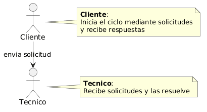
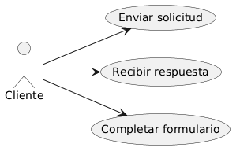
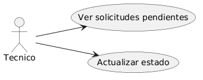
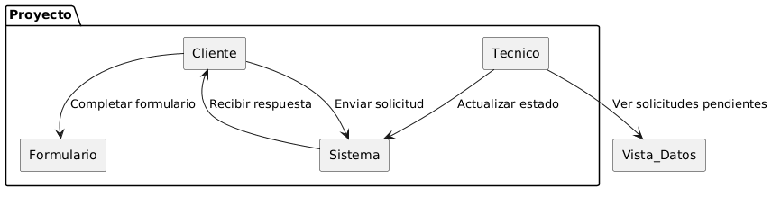
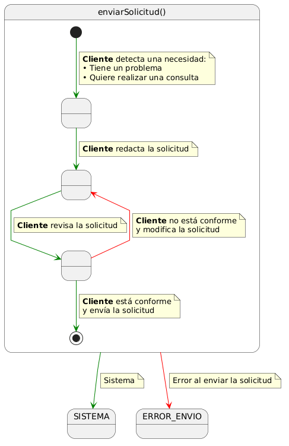
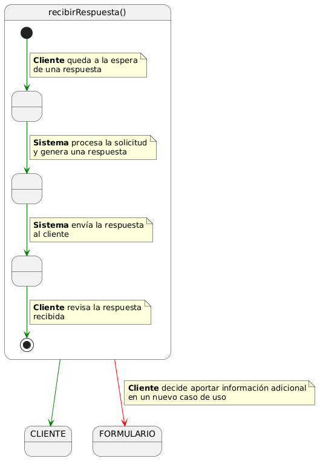

# Disciplina de Requisitos
## Actores
| Diagrama | Código Fuente |
|----------|---------------|
||[Ver Código de Actores](./Actores/codigo/Actores.puml)

El diagrama de actores representa los elementos externos que interactúan con el sistema y cómo se relacionan entre sí dentro del flujo de funcionamiento. En este caso, se identifican tres actores principales: el Cliente, el Técnico y el sistema automatizado implementado mediante Microsoft Power Automate.

El Cliente es el encargado de iniciar el proceso mediante el envío de solicitudes, como consultas o incidencias. Estas son procesadas por el sistema automatizado, que actúa como núcleo del sistema, gestionando la información, coordinando el flujo de trabajo y automatizando las respuestas. En aquellos casos en los que es necesaria intervención humana, el sistema asigna la solicitud al Técnico, quien se encarga de su gestión y resolución.

El funcionamiento del sistema sigue una estructura cíclica, en la que, tras la intervención del Técnico, la información se actualiza en el sistema y se genera una respuesta que es enviada de nuevo al Cliente, cerrando el ciclo y permitiendo su repetición continua.

## Casos De Uso Por Actor

| Cliente | Técnico |
|---------|---------|
|||
|[Ver código](./CdU/CdU_Cliente/codigo/CdU_Cliente.puml)|[Ver código](./CdU/CdU_Tecnico/codigo/CdU_Tecnico.puml)|

## Diagrama de Contexto

### Diagrama de Contexto   

| Diagrama | Código |
|---------|---------|
||[Ver código](./DdC/codigo/DdC.puml)|

## Priorizar Casos de Uso 

| Caso de uso                | Prioridad | Justificación                                                                              |
| -------------------------- | --------- | ------------------------------------------------------------------------------------------ |
| Enviar solicitud           | Alta      | Es el punto de entrada del sistema y condición necesaria para el resto de funcionalidades. |
| Recibir respuesta          | Alta      | Constituye la finalidad principal del sistema: proporcionar respuesta al cliente.          |
| Ver solicitudes pendientes | Media     | Permite la gestión por parte del técnico, pero depende de solicitudes previas.             |
| Actualizar estado          | Media     | Necesario para la gestión interna, ligado al seguimiento de solicitudes.                   |
| Completar formulario       | Baja      | Funcionalidad complementaria para aportar información adicional en casos específicos.      |

## Detallar Casos de Uso

### Caso de Uso - Enviar Solicitud

| Diagrama | Código |
|---------|---------|
||[Ver código](./Detallar_CdU/codigo/EnviarSolicitud.puml)|

Este caso de uso describe el proceso mediante el cual el cliente genera y envía una solicitud al sistema. El flujo comienza cuando el cliente identifica una necesidad, ya sea un problema o una consulta, lo que le lleva a redactar la solicitud.

Antes de enviarla, el cliente revisa su contenido para comprobar que la información es correcta. En caso de no estar conforme, puede modificarla tantas veces como sea necesario. Una vez validada, la solicitud es enviada al sistema.

Este proceso garantiza que las solicitudes recibidas tengan un mínimo nivel de calidad y coherencia, facilitando su posterior procesamiento.

### Caso de Uso - Recibir Respuesta

| Diagrama | Código |
|---------|---------|
||[Ver código](./Detallar_CdU/codigo/RecibirRespuesta.puml)|

Este caso de uso describe el proceso mediante el cual el cliente recibe una respuesta tras haber enviado una solicitud al sistema.

El flujo comienza con el cliente en espera de una respuesta. A continuación, el sistema procesa la solicitud previamente enviada y genera una respuesta, que es posteriormente enviada al cliente.

Finalmente, el cliente recibe y revisa la respuesta. En caso de necesitar aportar información adicional, podrá iniciar un nuevo caso de uso independiente mediante el formulario.

