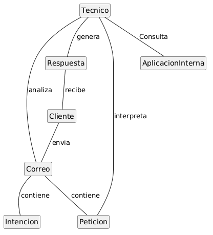
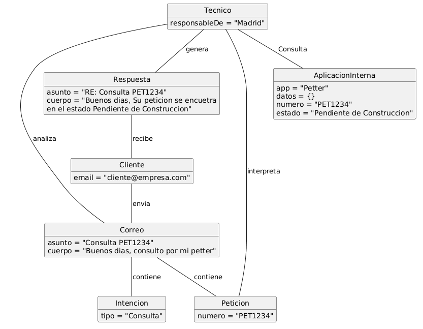
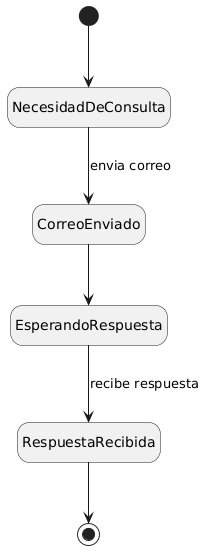
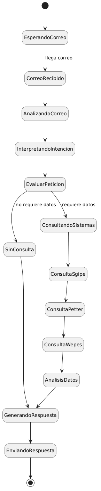

# Modelo de Dominio
## Diagrama de Clases 
| Diagrama | Código Fuente |
|----------|---------------|
||[Ver Código del Diagrama de Clases](./DdC/codigo/DdC.puml)

El diagrama de clases representa el funcionamiento actual del sistema de gestión del buzón. En él, un cliente envía un correo electrónico, que contiene una intención y, en muchos casos, una petición.

El técnico es el encargado de analizar el correo recibido, identificar su contenido e interpretar la petición. A partir de esta, consulta diferentes aplicaciones internas para obtener la información necesaria.

Finalmente, el técnico genera una respuesta, que es enviada al cliente como contestación a su solicitud.

## Diagrama de Objetos
| Diagrama | Código Fuente |
|----------|---------------|
||[Ver Código del Diagrama de Objetos](.DdO/codigo/DdO.puml)

El diagrama de objetos representa un caso concreto del funcionamiento del sistema. En él, un cliente envía un correo electrónico con una consulta asociada a una petición identificada por un número. Este correo contiene una intención, en este caso de tipo consulta.

El técnico recibe y analiza el correo, interpreta la petición y accede a una aplicación interna (Petter) para obtener la información correspondiente al número indicado. A partir de estos datos, genera una respuesta informando del estado de la petición, que finalmente es enviada al cliente.

## Diagrama de Estados
Se han elaborado diagramas de estados para las clases más importantes del sistema, concretamente Cliente y Técnico, con el objetivo de representar el cliclo de vida dentro del proceso de gestión del buzón.

### Ciclo de Vida del Cliente
| Diagrama | Código Fuente |
|----------|---------------|
||[Ver Código del Diagrama de Estado del Cliente](./DdE/codigo/Cliente.puml)

El diagrama de estados del Cliente describe un flujo sencillo en el que este pasa de un estado inactivo a enviar un correo y permanecer en espera hasta recibir una respuesta, tras lo cual vuelve a su estado inicial. Este comportamiento refleja la interacción básica del cliente con el sistema.

### Ciclo de Vida del Técnico
| Diagrama | Código Fuente |
|----------|---------------|
||[Ver Código del Diagrama de Estado del Tecnico](./DdE/codigo/Tecnico.puml)

Por otro lado, el diagrama de estados del Técnico representa un proceso más complejo. El técnico comienza en espera de nuevos correos, y cuando recibe uno, lo analiza e interpreta su intención. En función de esta interpretación, decide si es necesario consultar los sistemas internos. En caso afirmativo, realiza consultas a diferentes aplicaciones para obtener la información necesaria. Finalmente, genera y envía una respuesta, regresando al estado inicial a la espera de nuevos correos.

