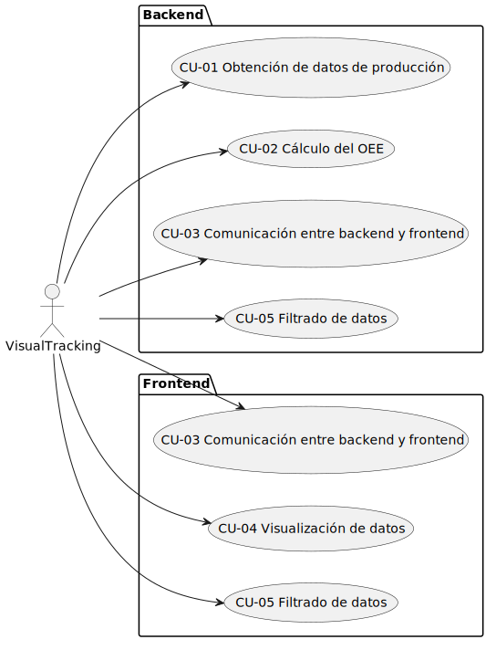
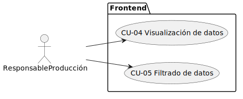
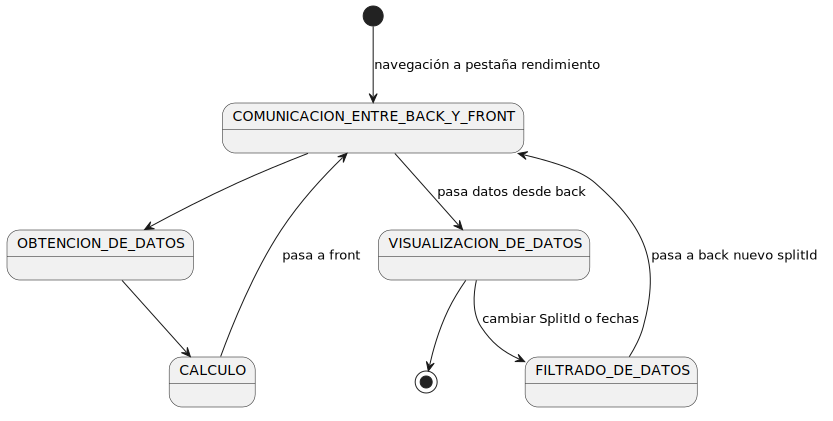
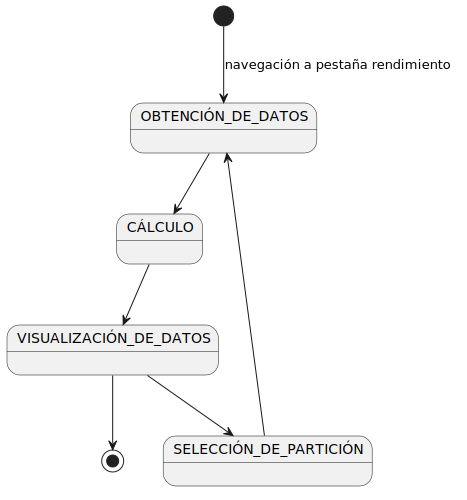

# Identificación y preiorización de casos de uso

A continuación, se mencionan brevemente los casos de uso identificados a partir de los requisitos funcionales detallados, los cuales están agrupados según las funcionalidades del sistema:
Obtención de datos de producción: el sistema debe obtener los datos teóricos de planificación y los datos reales de producción. Dicha información será la base para la correcta realización de los cálculos.
Cálculo del OEE: el sistema calculará los indicadores de disponibilidad, rendimiento y calidad a partir de los datos obtenidos. Luego los combinará para calcular el OEE.
Filtrado de datos: el sistema debe permitir realizar los cálculos para un split específico filtrando por unas fechas concretas, pudiendo también cambiar a otro split de la misma orden de trabajo.
Comunicación entre backend y frontend: el backend debe suministrar los datos calculados al frontend, mientras que el frontend debe ser capaz de comunicarse con el backend para recibir los datos y en caso de que sea necesario rehacer la petición en función de los filtros.
Visualización de datos: el sistema permitirá la visualización gráfica en un mismo panel de todos los datos requeridos. Esto incluye gráfico de líneas y puntos para producción por horas, gráficos de barras para OEE, tiempos y productos fabricados, tooltips informativos sobre tipos de paradas y motivos de rechazos, y tabla comparativa entre valores reales de indicadores y valores teóricos.

## Relación entre casos de uso y requisitos funcionales y priorización

|Caso de uso | Requisitos funcionales | Actor(es) | Prioridad |
|:---:|:---:|:---:|:---:|
|CU-01: Obtención de datos de producción | RF01 y RF02 | Visual Tracking | Alta |
|CU-02: Cálculo del OEE | RF03, RF04, RF05 y RF06 | Visual Tracking | Alta |
|CU-03: Comunicación entre backend y frontend | RF08 y RF09 | Visual Tracking | Alta |
|CU-04: Visualización de datos | RF10, RF11, RF12, RF13 y RF14 | Todos | Alta |
|CU-05: Filtrado de datos | RF07 y RF15 | Todos | Media |

## Diagrama de casos de uso - Visual Tracking

## Diagrama de casos de uso - Responsable de producción

## Diagrama de contexto - Visual Tracking

## Diagrama de contexto - Responsable de producción

