# Descripción de la solución propuesta 

## Backend 
### Organización general 
La implementación backend de la funcionalidad desarrollada, como ya se ha explicado 
anteriormente, se distribuye en tres módulos principales siguiendo la arquitectura existente en 
EMI Suite 4.0, con el fin de mantener diferenciadas las responsabilidades de transferencia de 
datos, exposición de servicios para llamadas de frontend y cálculo de la lógica de negocio.  

El módulo common contiene los objetos de transferencia de datos (DTOs) compartidos 
entre las distintas capas. El módulo vt-master-api actúa como punto de entrada de las peticiones 
del front y como capa intermedia hacia API, y el módulo API concentra toda la lógica de 
recuperación de datos, cálculo y construcción de la respuesta. 

#### Common
El módulo common recoge los DTOs utilizados para comunicar la información entre las 
distintas capas del backend. En esta funcionalidad se incorporan principalmente tres objetos 
relacionados con el cálculo ManufacturingInfoBySplitToCalculateDto, de rendimiento por partición: 
ManufacturingIndexInfoBySplitDto y ManufacturingIndexInfoDto. 

MnufacturingInfoBySplitToCalculateDto actúa como DTO de entrada. Su función es 
transportar los datos necesarios para solicitar el cálculo de rendimiento de una partición 
concreta. 

#### Atributos de ManufacturingInfoBySplitToCalculateDto
|Atributo | Tipo | Descripción |
|:---:|:---:|:---:|
|splitId | Long | Id del split |
|initDate | String | Fecha inicial |
|endDate | String | Fecha final |
|fullMode | boolean | Modo de cálculo completo |
|scrappedReportedInProduction | boolean | Rechazos reportados en producción |
|returnInProductionOnly | Boolean | Reporta unidades solo en fase de producción | 

Su campo principal es el identificador de la partición (splitId), el resto de atributos son 
opcionales.  

Además, fullMode y scrappedReportedInProduction, al ser de tipo boolean, tienen valor true o false. En cambio, returnInProductionOnly es tipo Boolean, por lo que además de 
true o false puede tener valor null. 

ManufacturingIndexInfoBySplitDto constituye el DTO principal de salida para esta 
funcionalidad. Agrupa toda la información calculada para una partición concreta, incluyendo 
datos de ejecución, piezas, tiempos, indicadores de rendimiento, desglose por material y curva 
de velocidad. De esta forma, el frontend recibe una respuesta estructurada y preparada para su 
posterior representación visual. 

##### Atributos de ManufacturingIndexInfoBySplitDto
|Atributo | Tipo | Descripción |
|:---:|:---:|:---:|
|splitId | Long | Id del split |
|executionInfo | ManufacturingExecutionInfoDto | Información de ejecuciones |
|piecesInfo | ManufacturingPiecesInfoDto | Información de piezas |
|timeInfo | ManufacturingTimeInfoDto | Información de tiempos |
|indexInfo | ManufacturingIndexInfoDto | Indicadores |
|piecesInfoByMaterial | Map<Long, ManufacturingPiecesInfoDto> | Piezas por material |
|speedCurve | List<Long> | Curva de velocidad por hora |

##### Atributos de ManufacturingExecutionInfoDto
|Atributo | Tipo | Descripción |
|:---:|:---:|:---:|
|target | BigDecimal | Objetivo de ejecuciones |
|executed | BigDecimal | Ejecuciones registradas |
|remaining | BigDecimal | Ejecuciones restantes |
|executedInProdEvent | BigDecimal | Ejecuciones registradas en evento productivo |
|remainingInProdEvent | BigDecimal | Ejecuciones restantes en evento productivo |
|executedCalculated | BigDecimal | Ejecuciones calculadas a partir de piezas |
|remainingCalculated | BigDecimal | Ejecuciones restantes calculadas |
|executedCalculatedInProdEvent | BigDecimal | Ejecuciones calculadas en evento productivo |
|remainingCalculatedInProdEvent | BigDecimal | Ejecuciones restantes calculadas en evento productivo |

##### Atributos de ManufacturingPiecesInfoDto
|Atributo | Tipo | Descripción |
|:---:|:---:|:---:|
|target | BigDecimal | Objetivo de piezas |
|manufactured | BigDecimal | Piezas correctas fabricadas |
|remaining | BigDecimal | Piezas restantes |
|scrapped | BigDecimal | Piezas rechazadas |
|scrappedByScrapType | Map<Long, Double> | Rechazos agrupados por tipo |
|manufacturedInProdEvent | BigDecimal | Piezas fabricadas en evento productivo |
|remainingInProdEvent | BigDecimal | Piezas restantes en evento productivo |
|scrappedInProdEvent | BigDecimal | Piezas rechazadas en evento productivo |
|scrappedByScrapTypeInProdEvent | Map<Long, Double>  | Rechazos agrupados por tipo en evento productivo |

##### Atributos de ManufacturingTimeInfoDto
|Atributo | Tipo | Descripción |
|:---:|:---:|:---:|
|targetSec | BigDecimal | Tiempo objetivo en segundos |
|productiveSec | BigDecimal | Tiempo productivo en segundos |
|elapsedSec | BigDecimal | Tiempo transcurrido en segundos |
|remainingSec | BigDecimal | Tiempo restante en segundos |
|downtimeSec | BigDecimal | Tiempo total de parada en segundos |
|downtimeSecByStop | BigDecimal | Tiempo de parada por paradas de máquina |
|downtimeSecByStopType | Map<Long, BigDecimal> | Tiempo de parada agrupado por tipo de parada  |
|indirectSec | BigDecimal | Tiempo de indirectos en segundos |
|indirectsSecByIndirectType | Map<Long, BigDecimal>  | Tiempo de indirectos agrupados por tipo |
|downtimeSecByMicrostop | BigDecimal | Tiempo de microparadas en segundos |
|downtimeSecByIndirect | BigDecimal  | Tiempo de parada causado por indirectos |
|downtimeSecByIndirectType | Map<Long, BigDecimal>  | Tiempo de parada agrupado por tipo de indirecto|

Por último, ManufacturingIndexInfoDto encapsula los indicadores principales de rendimiento. Estos valores se calculan en escala decimal, por lo que un valor de 1 equivale al 100%. 
##### Atributos de ManufacturingIndexInfoDto
|Atributo | Tipo | Descripción |
|:---:|:---:|:---:|
|cycleTimeTarget | BigDecimal | Tiempo de ciclo objetivo |
|cycleTime | BigDecimal | Tiempo de ciclo real |
|qualityIndex | BigDecimal | Calidad |
|cycleTimeInProdEvent | BigDecimal | Ciclo real en evento productivo |
|qualityIndexInProdEvent | BigDecimal | Calidad en evento productivo |
|availabilityIndex | BigDecimal | Disponibilidad |
|performanceIndex | BigDecimal | Rendimiento |
|oee | BigDecimal | OEE |
|oeeInProdEvent | BigDecimal  | OEE en evento productivo |

La incorporación de estos DTOs permite separar la información de entrada, la 
información de respuesta o salida, y los indicadores concretos de rendimiento. Además, facilita 
la reutilización de estas estructuras en los distintos módulos implicados en la comunicación 
dentro del backend.  

#### Vt-master-api

El módulo vt-master-api funciona como capa intermedia entre el frontend y la API. En 
esta capa se expone el endpoint: POST /clients/{clientId}/manufacturing-info/by-split. 

Este endpoint es recibido por el controlador ManufacturingInfoController de 
vt-master-api. Recibe la petición procedente del frontend, comprueba que el DTO de entrada es 
válido y prepara la llamada para API. En cuanto a la comprobación del DTO, se verifica que el 
splitId no sea nulo, que la fecha de fin sea posterior a la de inicio, y en caso de que la fecha de 
inicio y/o la de fin sean nulas se activa el modo completo. 

Una vez preparada la petición, el servicio ManufacturingInfoServiceImpl de 
vt-master-api recibe el identificador del cliente y el DTO de entrada, construye la URL, añade 
las cabeceras de autenticación y realiza una petición POST mediante RestTemplate. Por último, 
encapsula la respuesta en un ResponseObject con el estado HTTP correspondiente. En caso de error en la comunicación con API, se captura la excepción y se devuelve el código de estado 
recibido.

#### API

El módulo API contiene toda la lógica de la plataforma. La petición reenviada por el 
servicio ManufacturingInfoService de vt-master-api llega al endpoint: 

POST /production/clients/{client-id}/manufacturing-info/by-split. 

Este endpoint se encuentra definido en el controlador ManufacturingInfoController de 
API. El controlador recibe el DTO de entrada y delega la operación en la interfaz 
IManufacturingService, cuya implementación activa está en ManufacturingInfoServiceV2Impl.  

En esta clase, a partir del splitId del DTO se recuperan todos los datos necesarios de la 
base de datos y se construye la respuesta final. Se obtiene el AssignmentSplit correspondiente y, 
desde él, se accede al contexto de la partición: actividad, ruta, puesto de trabajo, duración 
planificada, ejecuciones previstas y parámetros teóricos como los tiempos de ciclo. 

Además de estos datos teóricos, se recupera información real del proceso productivo: 
outputs fabricados, rechazos, paradas, microparadas, procedimientos indirectos (que restan o no 
productividad) y ejecuciones registradas. Con esta información, el servicio calcula los valores 
de piezas, tiempos, indicadores y curva de velocidad, sin almacenar directamente el OEE final 
en base de datos. 

El resultado del cálculo es devuelto al frontend pasando por vt-master-api como un 
ManufacturingIndexInfoBySplitDto. 

### Flujo del backend
  

### Cálculos y métodos
La lógica de cálculos se concentra en la clase ManufacturingInfoServiceV2Impl. Dentro 
de esta implementación destacan cuatro métodos relacionados con la funcionalidad desarrollada: getManufacturingIndexInfoBySplit, getManufacturingInfoOfSplit, getIndexInfo y getManufacturingInfoForSpeedCurve. 

#### getManufacturingIndexInfoBySplit

Este método constituye el punto principal del cálculo por partición. Recibe como 
entrada un ManufacturingInfoBySplitToCalculateDto y utiliza su splitId para recuperar el 
AssignmentSplit correspondiente. Se define el rango temporal del cálculo, se cargan los datos 
del puesto de trabajo asociado, se validan los tiempo de ciclo y se preparan los valores base 
necesarios.

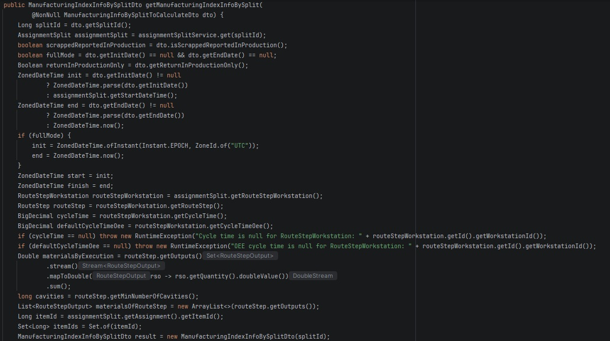  
A continuación, se realizan todas las consultas necesarias en paralelo, con el fin de 
obtener actividades, indirectos, outputs, rechazos, microparadas y ejecuciones del split.
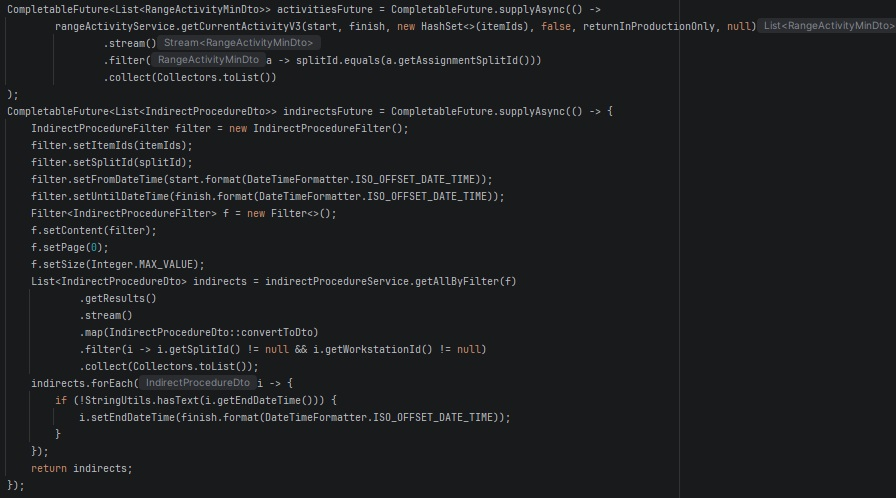  
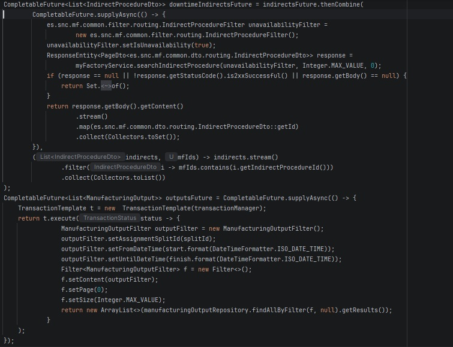  
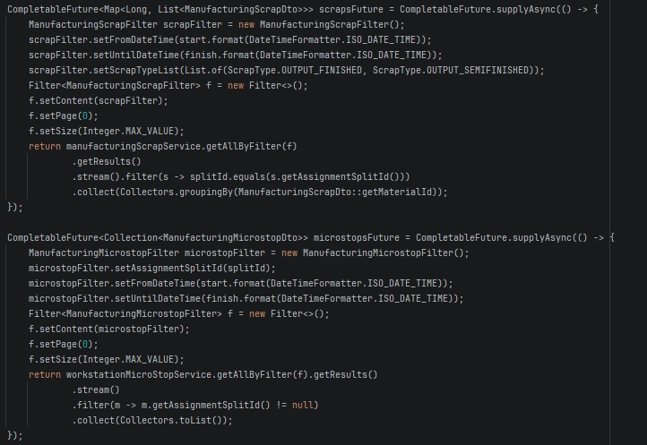  
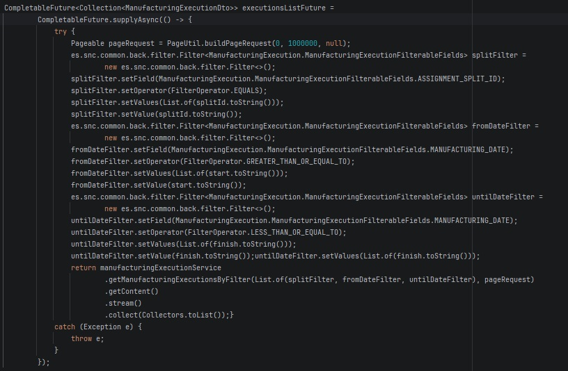  
La siguiente tarea es resolver las consultas realizadas anteriormente. Primero se 
declaran las listas que contendrán estos resultados y después se resuelven de forma paralela, con 
un tiempo máximo de 45 segundos. En caso de que se agote en alguna de ellas, se lanzarán 
excepciones. 

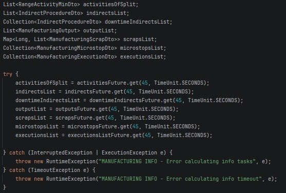  
Seguidamente, se preparan los datos auxiliares. Se calculan los rangos de actividad, se 
obtienen las paradas de máquina relacionadas, se cierran las paradas abiertas y se agrupan los 
outputs por material. 
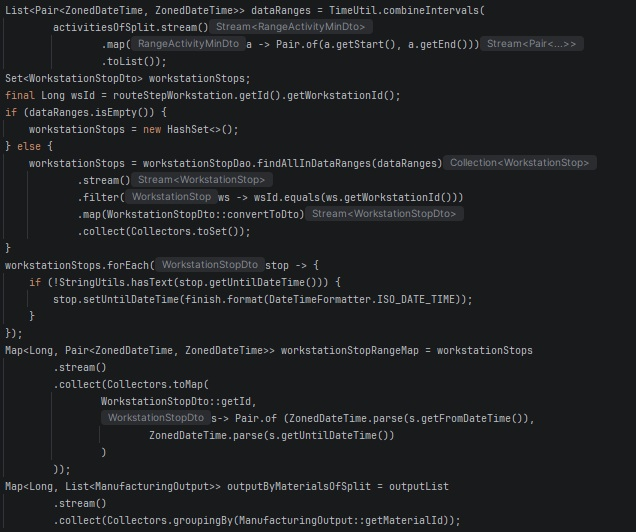  
Después, se delega el cálculo principal de tiempos, piezas, ejecuciones e indicadores del 
split al método explicado posteriormente “getManufacturingInfoOfSplit”. Se le pasan como 
parámetros todos los datos recopilados anteriormente.
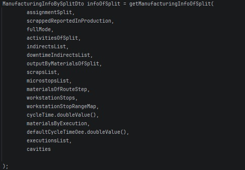  
Por último, se copian los resultados calculados al DTO de respuesta, se calcula la curva 
de velocidad mediante el método getManufacturingInfoForSpeedCurve a partir de las 
actividades y salidas de producción del split  
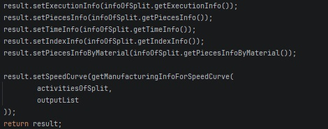  

#### getManufacturingInfoOfSplit
El método getManufacturingInfoOfSplit estaba diseñado previamente, se ha añadido 
únicamente la llamada a getIndexInfo para que además de toda la información de producción 
que calculaba del split anteriormente, añada el OEE y sus indicadores.
La información de producción que ya se calculaba inicialmente es: 
  - Piezas planificadas, fabricadas, rechazos y restantes.
  - Piezas pero separadas por material.
  - Tiempo trabajado, paradas, microparadas, indirectos y tiempo productivo.
  - Ejecuciones objetivo, ejecutadas y pendientes.

#### getIndexInfo

El método getIndexInfo se encarga de calcular los indicadores principales de 
rendimiento de la partición. En primer lugar, recibe como entrada la información de piezas 
producidas, tiempos de fabricación y datos teóricos necesarios para calcular los indicadores de 
rendimiento. 

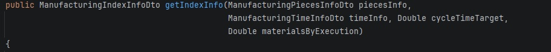  

A continuación, se obtiene el número de ejecuciones, se crea el DTO de respuesta y se 
extraen los valores principales que se utilizarán en los cálculos. Por un lado se obtienen las 
piezas buenas fabricadas y los rechazos, tanto totales como dentro de eventos productivos. Por 
otro lado, se recuperan los tiempos necesarios: tiempo total transcurrido, tiempo de parada y 
tiempo productivo. 

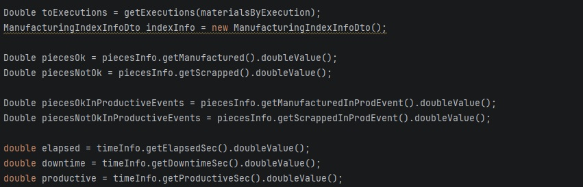  

En el siguiente fragmento, se realizan los cálculos principales. Primero se calcula el 
tiempo de ciclo real dividiendo el tiempo productivo entre las ejecuciones realizadas en caso de 
que exista producción y tiempo productivo. Después se calcula la disponibilidad, restando a 1 el 
cociente de tiempo de inactividad entre tiempo transcurrido. A continuación se calcula el 
rendimiento dividiendo el tiempo de ciclo teórico entre el tiempo de ciclo real. Y por último, se 
calcula la calidad general y calidad en eventos productivos, delegando en el método 
getQualityIndex, que divide en caso de haber piezas buenas, esas piezas entre las piezas totales 
(buenas + rechazos).

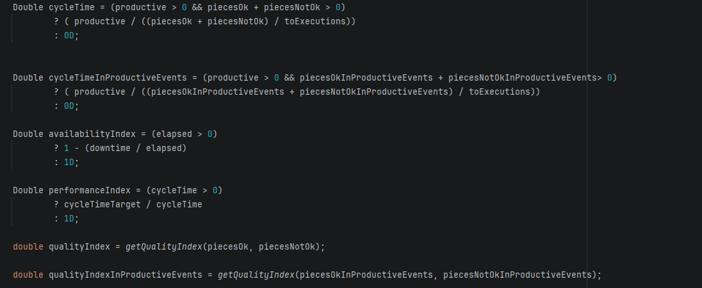  

Por último, se rellena el DTO de salida con los valores calculados y se calcula el OEE 
multiplicando los indicadores: calidad, rendimiento y disponibilidad.

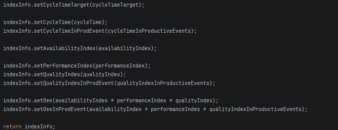  

#### getManufacturingInfoForSpeedCurve

El método genera la información necesaria para representar la curva de velocidad de 
producción. Para ello, utiliza los registros de fabricación ya recuperados previamente para la 
partición, sin realizar nuevas consultas a la base de datos. 

En primer lugar, recibe como parámetros de entrada dos colecciones: las actividades de 
producción de una partición concreta para comprobar si sigue activa o ha terminado, y las 
salidas de producción, es decir, registros de unidades fabricadas.

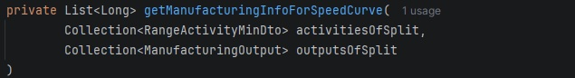  

Se prepara la lista de salidas de producción que se va a utilizar para calcular la curva. En 
caso de que la colección recibida sea nula, se crea una lista vacía. En caso contrario, se filtran los registros para eliminar valores nulos y outputs que no tengan fecha de fabricación. 

A continuación, se comprueba si después del filtrado inicial, hay registros válidos de 
producción. Si no hay ningún output con información suficiente, no se puede construir la curva 
de velocidad y se devuelve una lista vacía.

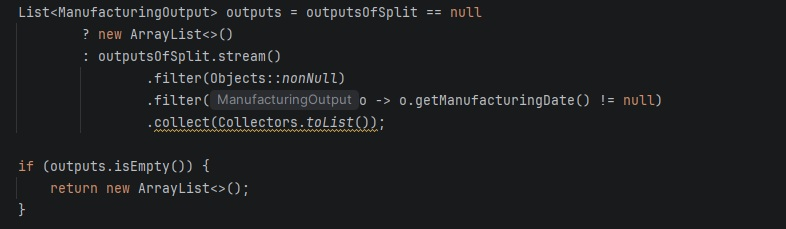  

Después, se define el rango temporal sobre el que se calculará la curva. Primero se 
obtiene la fecha y hora actual en UTC, que se usará si la partición sigue activa. Posteriormente, 
se calcula el inicio del rango tomando la fecha más antigua entre todos los outputs registrados. 
Por último, se comprueba si la partición continúa en ejecución, revisando si alguna de sus 
actividades no tiene fecha de finalización o se encuentra en estado activo. 

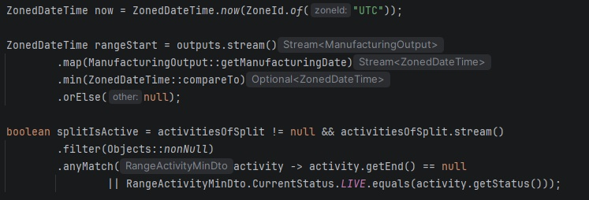  

En el siguiente fragmento, se establece el final del rango temporal. Si la partición sigue 
activa, la curva se calcula hasta el momento actual. Si ya ha terminado, se toma como referencia 
la fecha del último output registrado. En este caso, se añade un segundo para asegurar que el 
último registro quede incluido dentro del cálculo y se valida que la fecha final sea posterior a la inicial.

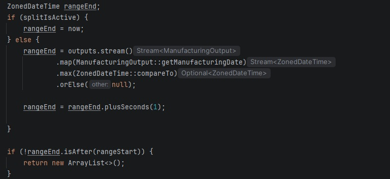  

Una vez se ha definido el rango temporal, el método calcula su duración total en 
segundos y la transforma en horas, redondeando hacia arriba para incluir los intervalos 
parciales. 

Por último, se recorre cada una de las horas del rango temporal calculado filtrando los 
outputs cuya fecha de fabricación se encuentra en el intervalo, y se suman las cantidades 
producidas. Al terminar el recorrido, el método devuelve una lista con los valores de producción 
en cada hora. 

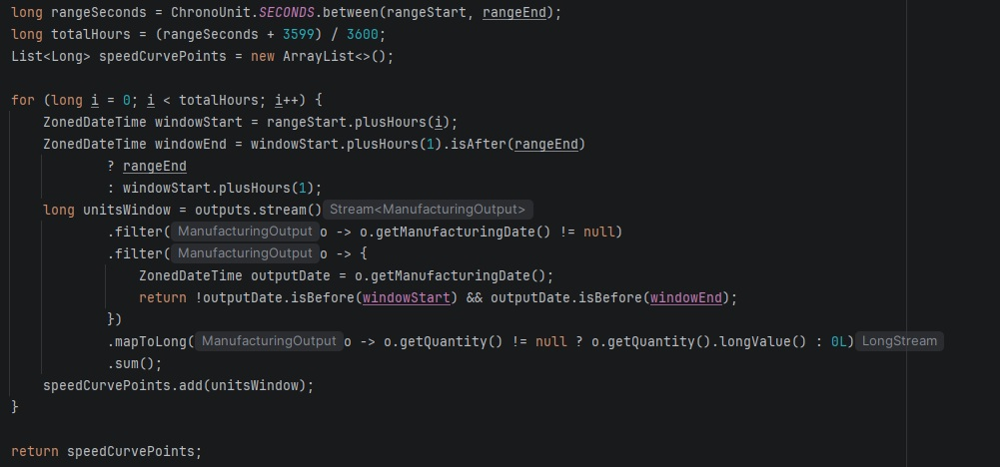  

### Solicitud y respuesta

En este apartado se muestra el ejemplo real de la comunicación entre el frontend y el 
backend para obtener la información de rendimiento asociada a un split concreto en producción.  

Request: ManufacturingInfoBySplitToCalculateDto en formato JSON

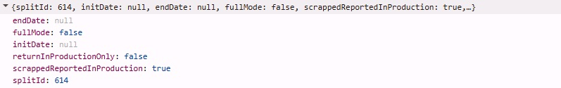  

Response: ManufacturingIndexInfoBySplitDto en formato JSON

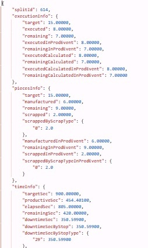  

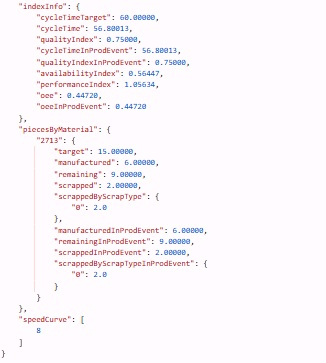  

