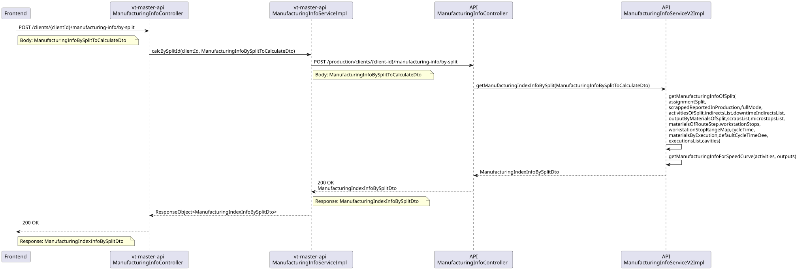

# Descripción de la solución propuesta 

## Backend 
### Organización general 
La implementación backend de la funcionalidad desarrollada, como ya se ha explicado 
anteriormente, se distribuye en tres módulos principales siguiendo la arquitectura existente en 
EMI Suite 4.0, con el fin de mantener diferenciadas las responsabilidades de transferencia de 
datos, exposición de servicios para llamadas de frontend y cálculo de la lógica de negocio.  

El módulo common contiene los objetos de transferencia de datos (DTOs) compartidos 
entre las distintas capas. El módulo vt-master-api actúa como punto de entrada de las peticiones 
del front y como capa intermedia hacia API, y el módulo API concentra toda la lógica de 
recuperación de datos, cálculo y construcción de la respuesta. 

#### Common
El módulo common recoge los DTOs utilizados para comunicar la información entre las 
distintas capas del backend. En esta funcionalidad se incorporan principalmente tres objetos 
relacionados con el cálculo ManufacturingInfoBySplitToCalculateDto, de rendimiento por partición: 
ManufacturingIndexInfoBySplitDto y ManufacturingIndexInfoDto. 

MnufacturingInfoBySplitToCalculateDto actúa como DTO de entrada. Su función es 
transportar los datos necesarios para solicitar el cálculo de rendimiento de una partición 
concreta. 

#### Atributos de ManufacturingInfoBySplitToCalculateDto
|Atributo | Tipo | Descripción |
|:---:|:---:|:---:|
|splitId | Long | Id del split |
|initDate | String | Fecha inicial |
|endDate | String | Fecha final |
|fullMode | boolean | Modo de cálculo completo |
|scrappedReportedInProduction | boolean | Rechazos reportados en producción |
|returnInProductionOnly | Boolean | Reporta unidades solo en fase de producción | 

Su campo principal es el identificador de la partición (splitId), el resto de atributos son 
opcionales.  

Además, fullMode y scrappedReportedInProduction, al ser de tipo boolean, tienen valor true o false. En cambio, returnInProductionOnly es tipo Boolean, por lo que además de 
true o false puede tener valor null. 

ManufacturingIndexInfoBySplitDto constituye el DTO principal de salida para esta 
funcionalidad. Agrupa toda la información calculada para una partición concreta, incluyendo 
datos de ejecución, piezas, tiempos, indicadores de rendimiento, desglose por material y curva 
de velocidad. De esta forma, el frontend recibe una respuesta estructurada y preparada para su 
posterior representación visual. 

##### Atributos de ManufacturingIndexInfoBySplitDto
|Atributo | Tipo | Descripción |
|:---:|:---:|:---:|
|splitId | Long | Id del split |
|executionInfo | ManufacturingExecutionInfoDto | Información de ejecuciones |
|piecesInfo | ManufacturingPiecesInfoDto | Información de piezas |
|timeInfo | ManufacturingTimeInfoDto | Información de tiempos |
|indexInfo | ManufacturingIndexInfoDto | Indicadores |
|piecesInfoByMaterial | Map<Long, ManufacturingPiecesInfoDto> | Piezas por material |
|speedCurve | List<Long> | Curva de velocidad por hora |

##### Atributos de ManufacturingExecutionInfoDto
|Atributo | Tipo | Descripción |
|:---:|:---:|:---:|
|target | BigDecimal | Objetivo de ejecuciones |
|executed | BigDecimal | Ejecuciones registradas |
|remaining | BigDecimal | Ejecuciones restantes |
|executedInProdEvent | BigDecimal | Ejecuciones registradas en evento productivo |
|remainingInProdEvent | BigDecimal | Ejecuciones restantes en evento productivo |
|executedCalculated | BigDecimal | Ejecuciones calculadas a partir de piezas |
|remainingCalculated | BigDecimal | Ejecuciones restantes calculadas |
|executedCalculatedInProdEvent | BigDecimal | Ejecuciones calculadas en evento productivo |
|remainingCalculatedInProdEvent | BigDecimal | Ejecuciones restantes calculadas en evento productivo |

##### Atributos de ManufacturingPiecesInfoDto
|Atributo | Tipo | Descripción |
|:---:|:---:|:---:|
|target | BigDecimal | Objetivo de piezas |
|manufactured | BigDecimal | Piezas correctas fabricadas |
|remaining | BigDecimal | Piezas restantes |
|scrapped | BigDecimal | Piezas rechazadas |
|scrappedByScrapType | Map<Long, Double> | Rechazos agrupados por tipo |
|manufacturedInProdEvent | BigDecimal | Piezas fabricadas en evento productivo |
|remainingInProdEvent | BigDecimal | Piezas restantes en evento productivo |
|scrappedInProdEvent | BigDecimal | Piezas rechazadas en evento productivo |
|scrappedByScrapTypeInProdEvent | Map<Long, Double>  | Rechazos agrupados por tipo en evento productivo |

##### Atributos de ManufacturingTimeInfoDto
|Atributo | Tipo | Descripción |
|:---:|:---:|:---:|
|targetSec | BigDecimal | Tiempo objetivo en segundos |
|productiveSec | BigDecimal | Tiempo productivo en segundos |
|elapsedSec | BigDecimal | Tiempo transcurrido en segundos |
|remainingSec | BigDecimal | Tiempo restante en segundos |
|downtimeSec | BigDecimal | Tiempo total de parada en segundos |
|downtimeSecByStop | BigDecimal | Tiempo de parada por paradas de máquina |
|downtimeSecByStopType | Map<Long, BigDecimal> | Tiempo de parada agrupado por tipo de parada  |
|indirectSec | BigDecimal | Tiempo de indirectos en segundos |
|indirectsSecByIndirectType | Map<Long, BigDecimal>  | Tiempo de indirectos agrupados por tipo |
|downtimeSecByMicrostop | BigDecimal | Tiempo de microparadas en segundos |
|downtimeSecByIndirect | BigDecimal  | Tiempo de parada causado por indirectos |
|downtimeSecByIndirectType | Map<Long, BigDecimal>  | Tiempo de parada agrupado por tipo de indirecto|

Por último, ManufacturingIndexInfoDto encapsula los indicadores principales de rendimiento. Estos valores se calculan en escala decimal, por lo que un valor de 1 equivale al 100%. 
##### Atributos de ManufacturingIndexInfoDto
|Atributo | Tipo | Descripción |
|:---:|:---:|:---:|
|cycleTimeTarget | BigDecimal | Tiempo de ciclo objetivo |
|cycleTime | BigDecimal | Tiempo de ciclo real |
|qualityIndex | BigDecimal | Calidad |
|cycleTimeInProdEvent | BigDecimal | Ciclo real en evento productivo |
|qualityIndexInProdEvent | BigDecimal | Calidad en evento productivo |
|availabilityIndex | BigDecimal | Disponibilidad |
|performanceIndex | BigDecimal | Rendimiento |
|oee | BigDecimal | OEE |
|oeeInProdEvent | BigDecimal  | OEE en evento productivo |

La incorporación de estos DTOs permite separar la información de entrada, la 
información de respuesta o salida, y los indicadores concretos de rendimiento. Además, facilita 
la reutilización de estas estructuras en los distintos módulos implicados en la comunicación 
dentro del backend.  

#### Vt-master-api

El módulo vt-master-api funciona como capa intermedia entre el frontend y la API. En 
esta capa se expone el endpoint: POST /clients/{clientId}/manufacturing-info/by-split. 

Este endpoint es recibido por el controlador ManufacturingInfoController de 
vt-master-api. Recibe la petición procedente del frontend, comprueba que el DTO de entrada es 
válido y prepara la llamada para API. En cuanto a la comprobación del DTO, se verifica que el 
splitId no sea nulo, que la fecha de fin sea posterior a la de inicio, y en caso de que la fecha de 
inicio y/o la de fin sean nulas se activa el modo completo. 

Una vez preparada la petición, el servicio ManufacturingInfoServiceImpl de 
vt-master-api recibe el identificador del cliente y el DTO de entrada, construye la URL, añade 
las cabeceras de autenticación y realiza una petición POST mediante RestTemplate. Por último, 
encapsula la respuesta en un ResponseObject con el estado HTTP correspondiente. En caso de error en la comunicación con API, se captura la excepción y se devuelve el código de estado 
recibido.

#### API

El módulo API contiene toda la lógica de la plataforma. La petición reenviada por el 
servicio ManufacturingInfoService de vt-master-api llega al endpoint: 

POST /production/clients/{client-id}/manufacturing-info/by-split. 

Este endpoint se encuentra definido en el controlador ManufacturingInfoController de 
API. El controlador recibe el DTO de entrada y delega la operación en la interfaz 
IManufacturingService, cuya implementación activa está en ManufacturingInfoServiceV2Impl.  

En esta clase, a partir del splitId del DTO se recuperan todos los datos necesarios de la 
base de datos y se construye la respuesta final. Se obtiene el AssignmentSplit correspondiente y, 
desde él, se accede al contexto de la partición: actividad, ruta, puesto de trabajo, duración 
planificada, ejecuciones previstas y parámetros teóricos como los tiempos de ciclo. 

Además de estos datos teóricos, se recupera información real del proceso productivo: 
outputs fabricados, rechazos, paradas, microparadas, procedimientos indirectos (que restan o no 
productividad) y ejecuciones registradas. Con esta información, el servicio calcula los valores 
de piezas, tiempos, indicadores y curva de velocidad, sin almacenar directamente el OEE final 
en base de datos. 

El resultado del cálculo es devuelto al frontend pasando por vt-master-api como un 
ManufacturingIndexInfoBySplitDto. 

### Flujo del backend
  

### Cálculos y métodos
La lógica de cálculos se concentra en la clase ManufacturingInfoServiceV2Impl. Dentro 
de esta implementación destacan cuatro métodos relacionados con la funcionalidad desarrollada: getManufacturingIndexInfoBySplit, getManufacturingInfoOfSplit, getIndexInfo y getManufacturingInfoForSpeedCurve. 

